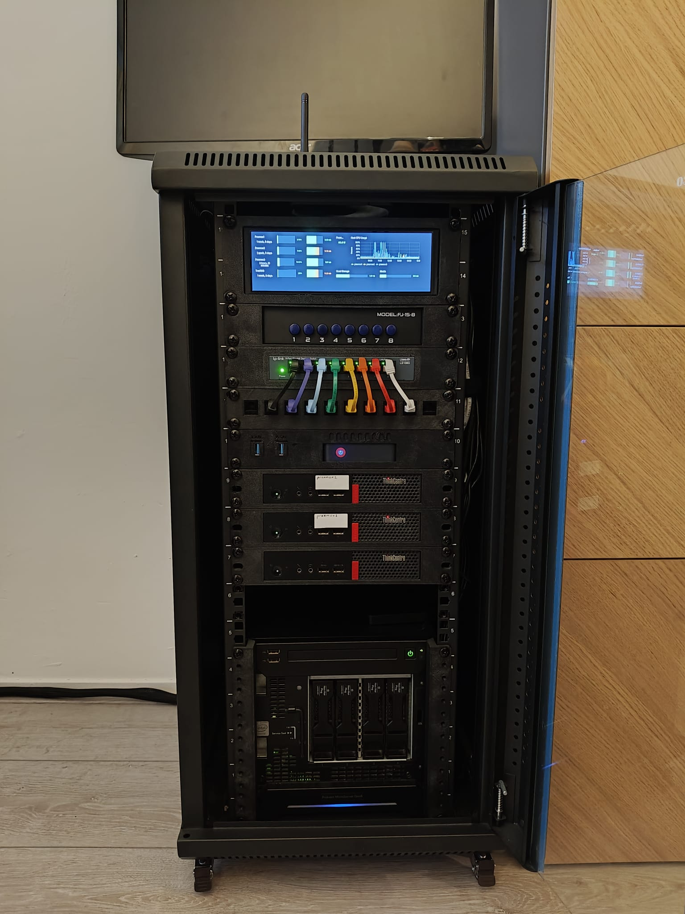
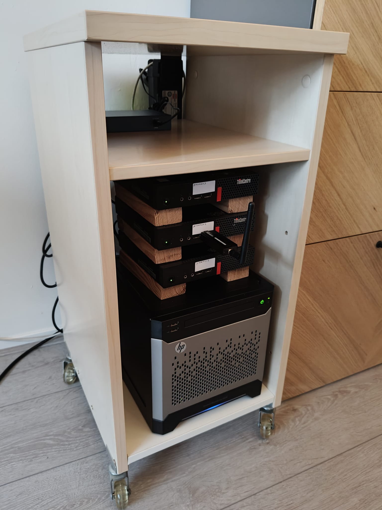
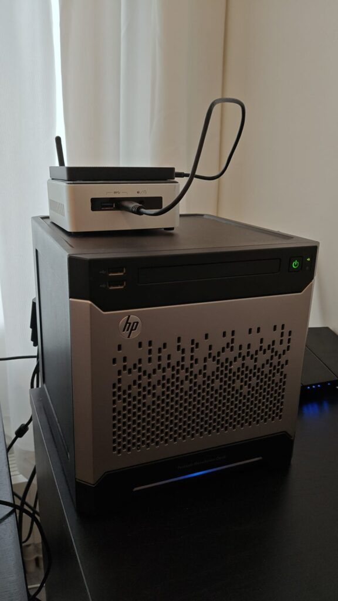
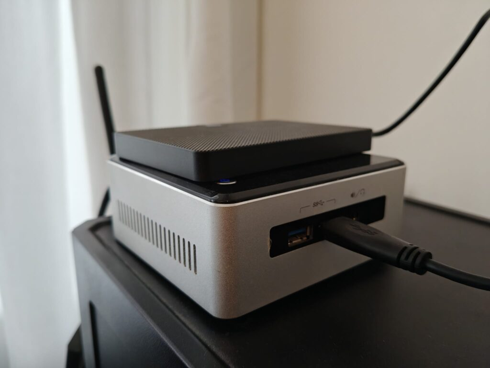

I wanted to write a little bit about my homelabbing adventures, so here we go! To start off: in the past I sometimes wanted to host stuff, like simple web services, but I never really knew how. I got started using a VPS at some point, to have as much control over what I was hosting as I possibly could at that point, but now that I have my own place, I can host even more and have even more control!

I might update this page as I add more hardware.

### Current hardware (02-11-2025)

| Component | Type | Comment |
| --- | --- | --- |
| Routers | ASUS RT-AX57 (AX3000)   ASUS RT-AX55 (BO3100) | Works well, nice GUI |
| Switch | TP-Link LiteWave 8-Port (LS108G) |  |
| ZigBee Dongle | SONOFF ZigBee 3.0 USB Dongle Plus, TI CC2652P |  |
| Proxmox Nodes | 3x Lenovo M710q   1x MILLSE G2 Pro Mini PC | i3 6100T, 16GB RAM, 256GB SSD   N150, 12GB RAM, 512GB SSD |
| NAS | HP MicroServer Gen 8 | Xeon E3-1260L, 16GB RAM, 128GB SSD, 2x 4TB HDD Mirror |

### General tips

- Define fixed IP ranges for your DHCP server to remember them more easily. My setup:
    - `**192.168.50.1**` The router
    
    - `**192.168.50.2-9**` Other networking devices / services, currently:
        - `**192.168.50.2**` Pi hole LXC (master)
        
        - `**192.168.50.3**` Pi hole LXC (duplicate, synced with nebula-sync)
        
        - `**192.168.50.4**` Pi hole LXC (duplicate, synced with nebula-sync)
        
        - `**192.168.50.8**` Tailscale Subnet Router LXC
        
        - `**192.168.50.9**` Cloudflare tunnel LXC
    
    - `**192.168.50.10-19**` Proxmox nodes, currently:
        - `**192.168.50.10**` _Decomissioned_ Proxmox node 0 (Intel NUC5i3RYH)
        
        - `**192.168.50.11**` Proxmox node 1 (Lenovo M710q)
        
        - `**192.168.50.12**` Proxmox node 2 (Lenovo M710q)
        
        - `**192.168.50.13**` Proxmox node 3 (Lenovo M710q)
        
        - `**192.168.50.18**` Proxmox Datacenter Manager VM
        
        - `**192.168.50.19**` _Reserved for future Proxmox Backup Server_
    
    - `**192.168.50.20-29**` Network storage, currently:
        - `**192.168.50.20**` HP MicroServer Gen 8 (TrueNAS) Port 0
        
        - `**192.168.50.21**` HP MicroServer Gen 8 (TrueNAS) Port 1
        
        - `**192.168.50.22**` HP MicroServer Gen 8 iLO
    
    - `**192.168.50.30-39**` General services, currently:
        - `**192.168.50.30**` VPS (Ubuntu Server VM)
        
        - `**192.168.50.31**` Home Assistant (HAOS VM)
        
        - `**192.168.50.32**` Firefly III LXC
        
        - `**192.168.50.33**` Actual Budget LXC
        
        - `**192.168.50.34**` Grafana LXC
        
        - `**192.168.50.35**` InfluxDB LXC
        
        - `**192.168.50.36**` Immich LXC
        
        - `**192.168.50.37**` Vaultwarden LXC
        
        - `**192.168.50.38**` NextCloud VM
    
    - `**192.168.50.40-49**` Media services
        - `**192.168.50.40**` Jellyfin LXC
        
        - `**192.168.50.41**` Sonarr LXC
        
        - `**192.168.50.42**` Radarr LXC
        
        - `**192.168.50.43**` QBitTorrent LXC
        
        - `**192.168.50.44**` Prowlarr LXC
        
        - `**192.168.50.45**` FlareSolverr LXC (disabled)
        
        - `**192.168.50.46**` Byparr LXC
        
        - `**192.168.50.47**` Bazarr LXC
    
    - `**192.168.50.50-199**` DHCP
        - Nebula-sync LXC (I don't really care for this to have a static IP)
    
    - `**192.168.50.200-254**` Other devices (smart devices, phone, laptop, ...)

## My Journey

**This text is in reverse chronological order, so the latest version is at the top.**

### A proper rack

I wanted my lab to look nice, so I decided to buy a 10 inch rack to fit everything in. I am fortunate enough to be able to get rack mounts 3D-printed at work, so I just had to get a rack and whatever else I wanted in there. I got a [Wisecoco 7,84 inch display](https://nl.aliexpress.com/item/1005005571198404.html), which I epoxied to [this rack mount for it](https://www.printables.com/model/937539-784-lcd-mount-for-10inch-2u-rack). It was some effort to set it up with a grafana dashboard, but it works now! I also got [an 8-way VGA switch](https://nl.aliexpress.com/item/1005009695991081.html) so I can easily switch to whichever system and attach a keyboard for local debugging. I also 3D printed a patch panel and inserted some RJ45 keystones, and got some [very short rainbow-colored patch cables](https://www.reichelt.com/nl/en/shop/product/cat_6_slim_patch_cable_u_utp_0_1_m_blue-205287) to go with it. It was a lot of fun to put everything in the rack, and to tie together all the cables in a neat way. I also installed a Noctua fan at the top for some (very silent) airflow.

Sadly, the rack works as a faraday cage for my ZigBee dongle, so I had to put it on top with an extension cable, but I am very happy with how it looks now.

### More power

I wanted to have a more robust system, as my NUC's SSD was starting to fill up. I decided to buy 3 Lenovo m710q MFF Tiny PCs with 256 SSDs to distribute my different services across them, as well as hosting multiple piholes to ensure availability. To house all of this, I no longer wanted to just stack them on my office cabinet, so I decided to take an old cabinet with wheels, saw out the back panel, add a bottom panel and mount a plug box on the back.

Since my router no longer has enough ports to plug in all my hardware, I also got a TP-Link LiteWave 8-Port Gigabit network switch and some short length CAT5e cables to attach all of my new hardware.

### Added storage

I also wanted to have my own storage, so I bought an HP MicroServer Gen 8 (also second hand) with 2x 4TB 3.5" HDDs. Getting set up there was a bit more annoying, as apparently booting from an SSD on the internal SATA port is complicated on the MicroServer Gen 8.

### Baby's first homelab

It doesn't have to be expensive to start homelabbing, though it likely will become more expensive as you get more and more excited. I got started by buying my own router and buying an Intel NUC5i3RYH second hand, with a 128GB SSD and 8GBs of RAM. Quickly, I wanted to have more RAM available for all my services, so I upgraded the RAM to 16GB and bought a Zigbee dongle for integrating smart devices with Home Assistant. I wanted to have my own router (behind my ISPs router) so that I can configure everything that I want, and changing ISP would be a simple matter of just plugging in my new router, without having to reconfigure a bunch of stuff (made even easier with the Cloudflare tunnel I set up later!).

