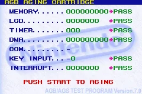

AGS Aging Cartridge is a test used by Nintendo to test GBA systems. I have used it myself mostly to see how well my emulator performed in it while developing it, but I never knew exactly what the tests did. There wasn't much documentation on the tests other than what Normmatt had already decompiled, but this led me mostly to the names and entry points (this was especially useful!) of the tests. Therefore, I decided to decompile the tests myself, and put them in a central place to help future emulator developers!

You might recognize it from the following screenshot:

<figure>

<figcaption>

AGS aging cartridge

</figcaption>

</figure>

The code was quite clean, and most of it wasn't too hard to decompile. The hardest test to decompile was the DMA address control test, since it was so large, it used weird inlined functions it seemed and GHidra kind of messed up the stack on that one.

All tests in the suite return flags for which parts of the test the system failed, but these are never seen on the screen. In my decompilation, besides the actual code for the test, I also documented where in the ROM the test functions start, where they return, and what the return flags mean. I also added a python script to patch the ROM to write the test results to address 0004 (in the BIOS, so it won't do anything, you can catch these writes and show print them to the console to see what the test returned).

After finishing decompiling the tests that are enabled in the AGS ROM with md5 sum `9f74b2ad1d33e08e8a570ffe4564cbc3`, I noticed that there were some tests that were unused. I also wrote a script to patch the same ROM to use the unused tests instead of some of the default tests. Some of them will freeze up a system though (I think), so they might be disabled for this reason.

That patch script can also change it so all tests are disabled, or so that you can always get the "push start to aging" prompt, and the following animation, regardless of whether you pass all tests or not. Usually you would get a prompt saying "error occurred!!" if you failed any and it would freeze up.

I just want to stress that it is not a full decompilation of the ROM, they are only the tests, and it was meant mostly as info for people interested in them. AGS was always kind of a black box to me, but it doesn't have to be anymore now!

The repository is [here](https://github.com/DenSinH/AGSTests), feel free to check it out. All the info on the test functions is in the .h files, the .md files and of course the tests.c files for the tests in each category, corresponding to the respective folder.
