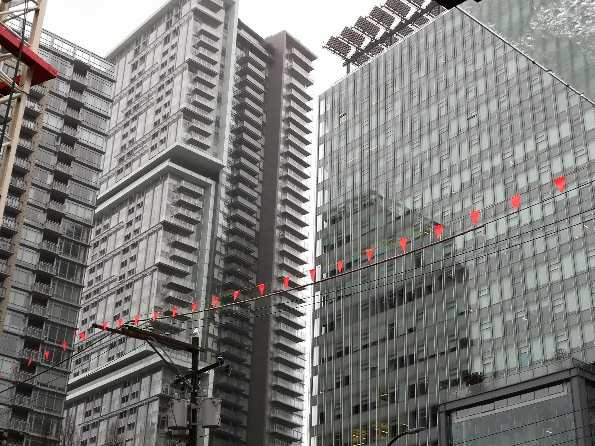
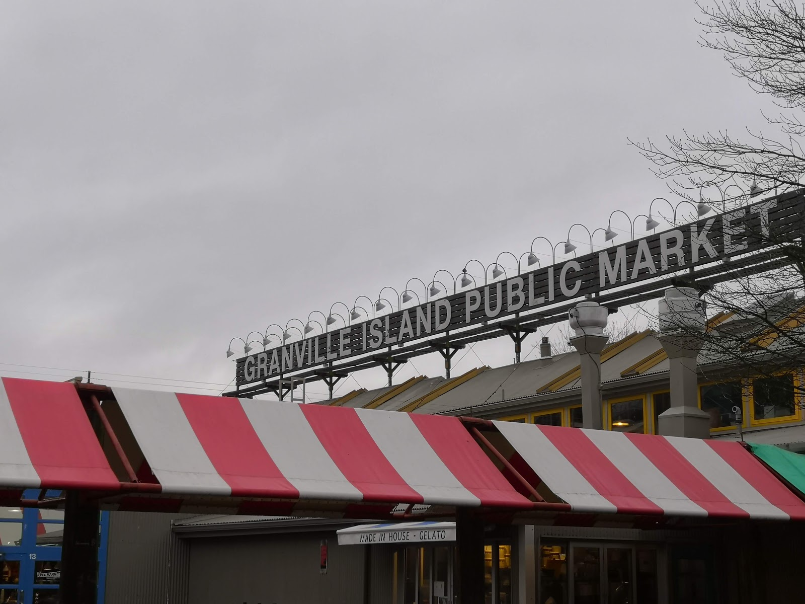
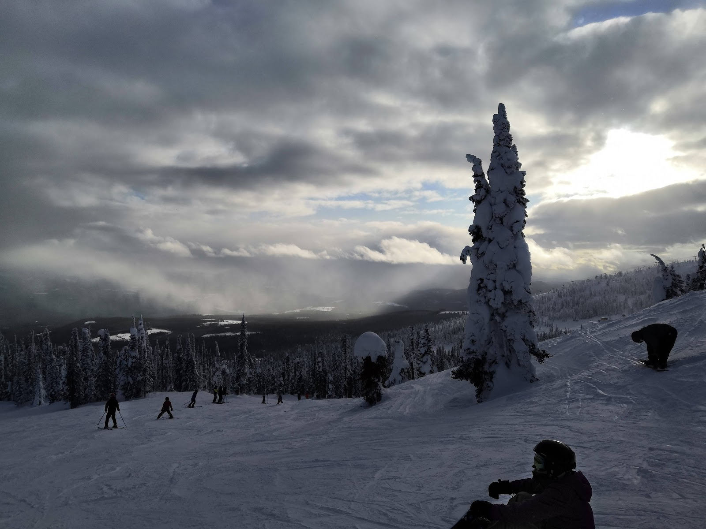
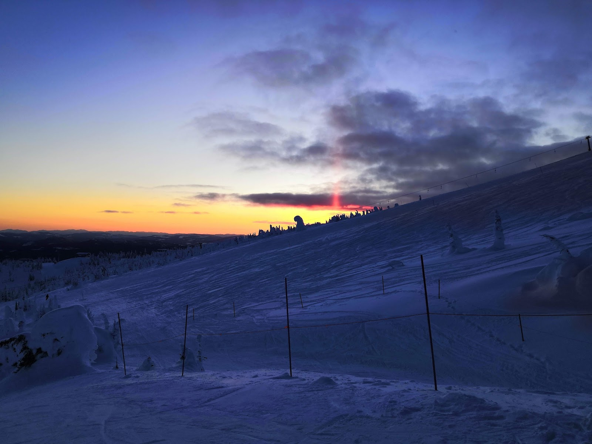
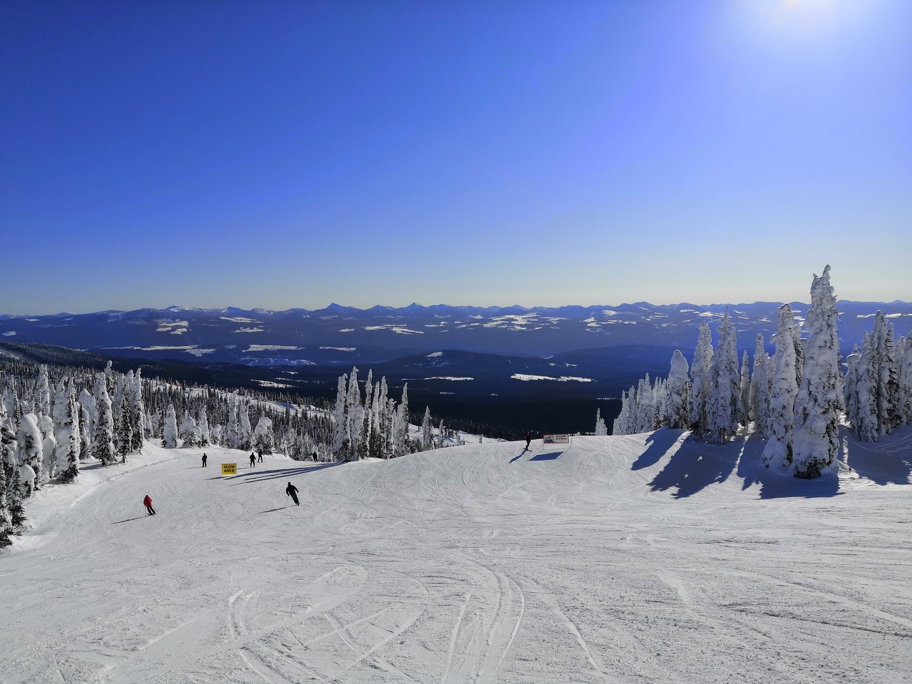
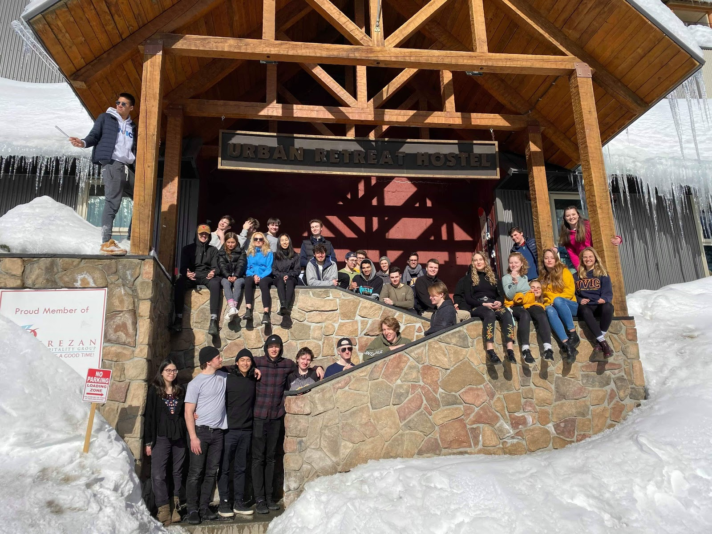

Het is al even geleden dat ik een post heb gemaakt. Ik was twee weken geleden ineens erg druk, en vorige week de hele week weg, dus ik had niet veel tijd gehad. Twee weken geleden was de laatste week voor Reading Break. Ik kreeg voor een van mijn vakken ineens een project op dat komende maandag af zou moeten zijn (maar die deadline is dus uiteindelijk verzet halverwege reading break). Ineens grote stress natuurlijk, want het was geen klein project, en ik wilde het wel goed doen. De rest van de week was niet super bijzonder. John, Sara, Veera en ik zijn weer naar trivia gegaan, waar we bijna 3e waren geworden. Verder heb ik veel tijd besteed aan BattleSnake en het project.

Vrijdag gingen Gijs en ik op weg naar Vancouver, om daar met zijn tweeen een dagje rond te lopen en vervolgens onze tripjes voort te zetten. Vrijdagavond kwamen we dan aan in Vancouver, en toen we onze kamer inliepen werden we begroet door onze dronken, Franstalige kamergenoot, en de alcoholwalm die hem vergezelde. We besloten maar snel weer uit de kamer te gaan en wat te gaan eten en drinken bij een bar in de buurt. Toen we gingen slapen werden we midden in de nacht weer door hem verstoord toen hij om 4 uur 's nachts de kamer in en uit ging lopen (en daarbij ook nog de deur op een kier liet staan). De dag daarna zijn we dus vermoeid op pad gegaan door Vancouver. Het was een beetje regenachtig, dus we konden niet heel veel dingen buiten doen.

We zijn maar naar het aquarium in Stanley park gegaan, en hebben daarna wat door Stanley Park gelopen (het enige wat ik echt nog wilde doen in Vancouver). Daar werd ons gevraagd of we een foto van een stelletje wilden maken, waarvan het vriendje plots een huwelijksaanzoek deed! Verbijsterd liepen we daarna verder en zijn we naar Granville Island gegaan, waar we nog wat winkeltjes in waren gelopen waar ik niet was geweest.

Die avond waren er ook wat mensen die mee zouden gaan op de skitrip in Vancouver, maar we hadden niet echt zin om uit te gaan. We zijn uiteindelijk naar een Comedyclub gegaan, waar we met geluk binnengekomen waren (het was al 2 weken uitverkocht, maar er waren mensen niet komen opdagen), nadat we wat Europese biertjes (Karmeliet!) hadden gedronken in een bar in de buurt.

De dag daarna konden we 's ochtends nog samen doorbrengen, en zijn we naar Chinatown en langs Downtown Eastside gelopen (de gure buurt van Vancouver), waar ontzettend veel mensen laveloos naast crackpijpen op de grond lagen. Toen nog even door Gastown gewandeld en wat gedronken en daarna moest ik de bus pakken richting de ferryterminal.

Vanaf daar begon de skitrip naar de Big White. De 6 uur durende busreis daarnaartoe was al heel gaaf, met uitzichten over besneeuwde bergen en valleien, en een leuke groep mensen om mee te praten. Toen we boodschappen gedaan hadden en ingekwartierd waren gingen we naar de kroeg in het skiërsdorpje, Snowshoe Sam's. Blijkbaar was er een soort feestavond aan de gang, en na een biertje of twee was ik terug gegaan naar het hostel, en heb ik me met een goede nachtrust voorbereid op het skiën de dagen erna.  
De dag daarna zijn we rond half 9 richting de skiverhuur gegaan, en daarna meteen de piste op. Het was "family day" in Canada, dus veel mensen hadden vrij, en behalve wat bewolking aan de top van de berg was het weer ook heel goed, dus het was best druk op de pistes die dag. Na een dag skiën zijn we rond 4 uur weer terug gegaan naar het hostel en konden we weer wat uitrusten.

De dag daarna was het weer nog beter. nog steeds wat bewolkt, maar alles was goed zichtbaar. Die dag heb ik ook wat lastigere pistes gedaan (dubbelzwart, met een hele groep) en ging ik voor het eerst nachtskiën! Het uitzicht is van zichzelf al prachtig, maar met zonsondergang is het echt ongelooflijk. Toen iedereen terug ging, ging ik mee, maar bij het hostel waren er mensen net van plan om weer weg te gaan, zonder mijn spullen uitgetrokken te hebben besloot ik dus weer mee terug te gaan en in het donker nog wat pistes te doen. Dan is de piste helemaal leeg, en kan je echt je gang gaan. Ik had die dag wel mijn pols een beetje verstuikt met een val, dus daar had ik 's avonds wel een beetje last van, maar dat kan de pret van skiën niet bederven.

De dag daarna was het echt heel mooi weer, geen wolkje aan de lucht en best warm. 's Ochtends hebben we een hoop pistes gedaan, en 's middags gingen we met een hele groep op pad. Zij waren allemaal echt heel ervaren, dus ik raakte ze een beetje kwijt, en was gevallen en had mijn knie verdraaid. Vanuit de lift riep iemand dat ze naar het café bij de Gem Lake lift gingen, dus besloot ik daar ook maar heen te gaan. Daarna ben ik direct terug naar het hostel gegaan, en heb ik mijn knie afgekoeld met wat ijs van buiten. Die avond gingen mensen weer nachtskiën, maar hoe graag ik ook mee wilde, ik besloot toch maar om het niet te doen, en de dag daarna weer te proberen om te skiën.

Gelukkig voelde mijn knie de dag daarna weer wat beter, en met een steunband die ik kon lenen ging het skiën wel. Die dag heb ik de hele dag gewoon normale pistes gedaan, en kon ik mee naar het nachtskiën weer die avond. Daarna gingen mensen schaatsen, maar ik ben met wat anderen aan de kant bij een vuurkorf blijven staan toekijken.

Gister moesten we dan weer terug in de bus, en was het skiën voorlopig voorbij. Eerst een groepsfoto gemaakt met bijna iedereen (een iemand had haar been gebroken, het kan dus nog erger), en daarna de bus in. Iedereen was uitgeput dus 's ochtends was het vrij stil. Ik kon dus wat lezen voor de midterm die ik maandag heb. 's Middags had iedereen weer wat meer energie, en werd het een stuk gezelliger in de bus. Uiteindelijk na de ferry dus afscheid nemen van iedereen en rustig naar bed gaan.  
Vandaag begint 't dus allemaal weer, boodschappen doen, de was doen, dingen voor school voorbereiden etc. Er komt binnenkort een reünie voor de trip, dus daar kan ik al niet op wachten. Uiteindelijk had ik me geen betere reading break kunnen voorstellen, behalve misschien zonder blessures.
