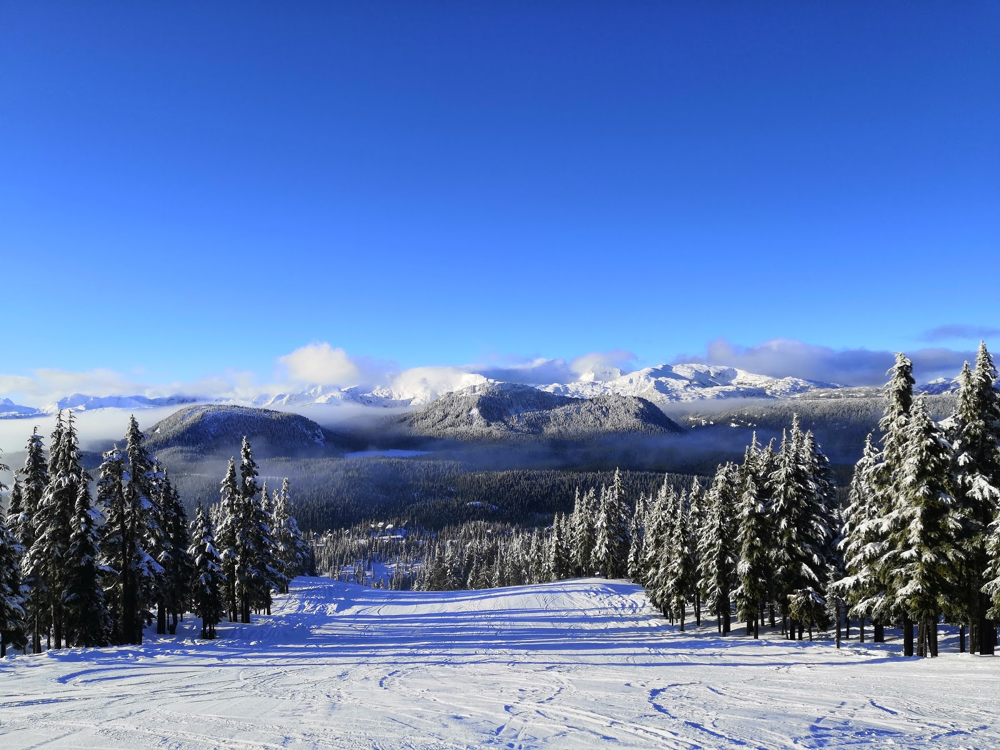
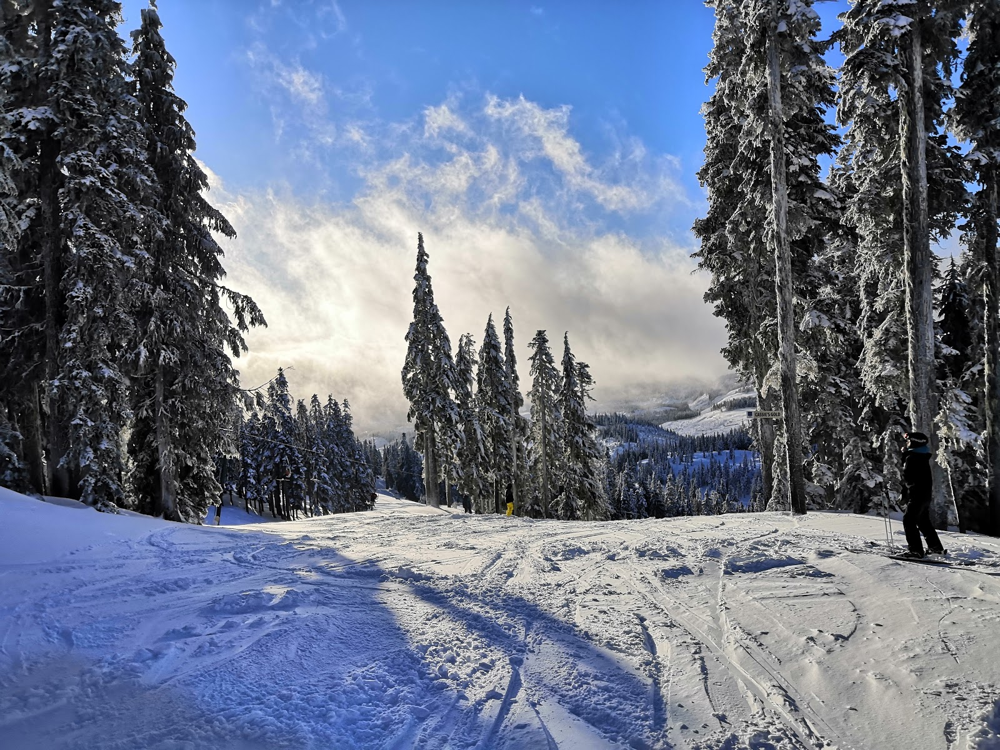

Afgelopen week was een drukke week. Maandag ben ik na college samen met Sophie, Gijs en een vriendin van Sophie naar een bar geweest. Eerst hadden we een drankje gedaan in een kroeg die schijnbaar goed eten en drinken had. Je kon daar ook cocktails bestellen waar dan een fles Corona op zijn kop ingezet werd. Daarna gingen we door naar de club ernaast. Nadat we een paar "loonies" aan een kluisje hadden verspild dat niet werkte konden we eindelijk verder naar binnen. We moesten wel op tijd naar huis, want we moesten de bus nemen, zoals velen, dus om 00:00 moesten we echt wel uit die club vertrekken.

Dinsdag gingen Sophie, Gijs en ik dan eindelijk echt schaatsen op een ijshockeybaan in Victoria. Sara en John konden niet mee, want Sara had nog college, en John was nog steeds een beetje ziek. Het is al even geleden dat ik geschaatst heb, dus het was wel even wennen weer, maar na een paar minuten had ik het wel weer een beetje te pakken. Zonder te vallen heb ik het anderhalf uur overleefd.

Woensdag was de eerste repetitie van de Vikes band. Ik moest in de CARSA gym zijn om 20:00, dus besloot maar op de campus te blijven en daar wat te eten samen met Sara en John. We waren erachter gekomen dat woensdagavond burgeravond was bij een van de pubs, dus hebben we daar gegeten. De band was niet bepaald hoog niveau qua spel, maar ja wat verwacht je als de vereisten "basic ability to play an instrumet" zijn. Blijkbaar lopen ze ook, maar alleen bij binnenkomst van het optreden. Ze deden wel leuke muziek, een beetje popmuziek enzo. Ik heb best weinig gespeeld de afgelopen maand dus de conditie was niet helemaal lekker, en het instrument dat ik heb gehuurd is ook niet bepaald een topmodel, maar voor daar maakt dat niet zo veel uit. De mensen daar waren ook heel aardig, en blijkbaar is het voor hun standaard om na de repetitie naar de Mac te gaan. Het leek erop dat de helft van de mensen daar een auto had, dus ze wilden me wel meenemen met de auto en afzetten bij mijn huis na afloop. Ik was ook meteen in de bandgroepsapp gezet. Helaas zou ik er de eerste optredens niet bij kunnen zijn, want we gaan SKIËN met het huis!

Donderdagavond moest ik dus skispullen halen. Dat heb ik samen met Gijs gedaan bij een winkelcentrum downtown. Ik moest daarna wel weer terug naar de campus, want ik zou gaan klimmen met Sarah Jane, iemand anders die ik via Sara en John ontmoet heb. Het klimmen was ook leuk, hoewel het wel een beetje zwaar werd aan het einde. Mijn handen en onderarmen begonnen een beetje te verkrampen, ook al had ik alleen de makkelijkste en een-na-makkelijkste routes geklommen. Daarna hadden we met Sara en John afgesproken bij de karaoke weer. Veera uit Finland was ook gekomen, maar die was nog ziek (vreselijk virus dat hier rond gaat) dus die ging vroeg naar huis. Ik had nog niks gegeten, en het drinken krijg je natuurlijk sneller dan eten, dus het eerste biertje zat er al in voordat ik gegeten had (van klimmen krijg je ook dorst). Dat maakte de avond wel gezellig, ondanks het feit dat maar een van onze 6 aangevraagde nummers voorbij kwam... Aan het eind van de avond stond ik buiten nog wat te praten met John en Sara. Zij waren heel enthousiast over een bepaalde band waar ik nog nooit van gehoord had. Dat moment voelde ik me wel even eenzaam, en ging ik maar met mijn aangeschoten kop tegen niemand Nederlands praten. Niemand kon me toch verstaan. Daarna ging ik naar huis en daar was Sophie nog wakker.

Daarna was het dan zo ver, het was vrijdag en vandaag zouden we naar Mt. Washington rijden om te gaan skiën. We kwamen 's avonds laat aan bij het huis van Sophie's oom, en hebben haar daar afgezet. Zij zou daar na het weekend nog even blijven om hun te bezoeken, want ze gaat over een week naar huis. Tosca, Gijs en ik (alle Nederlanders in het huis) sliepen in een motel 2 minuten daarvandaan. De ochtend erna stonden we met moeite op, en hebben we na het ontbijt Sophie opgepikt om vervolgens een uur de berg op te rijden naar de pistes.

We huurden onze spullen, Sophie en Gijs namen lessen, want het was hun eerste keer skiën, en daarna gingen Tosca en ik samen de pistes op. Het uitzicht was vanaf de lift al echt prachtig, en van bovenaan nog beter. Ik kon niet stoppen met zeggen hoe leuk ik het vond om weer te skiën, en wilde maar al te graag de helling af en meteen door.

Toen het lunchtijd was, was de les van Gijs en Sophie afgelopen. Helaas hadden ze niet zo'n goede instructeur. De instructeur had blijkbaar niet echt uitgelegd hoe je goed bochtjes kon maken, en ze hadden het er erg zwaar mee. Daarna gingen we dus met zijn vieren bij het oefenweitje skiën. Je moest daarvoor met 3 tapijtjes omhoog, maar Tosca en ik hadden skipassen, dus wij gingen met een skilift omhoog en ontmoetten ze bovenaan het oefenweitje weer. Daar hebben wij ze wat tips gegeven (niet dat ik nou echt een expert ben). Omdat het niet zo'n spannende helling was besloot ik maar om te oefenen hoe je achteruit kan skiën. Toen we weg moesten bij de piste was het alweer donker, en gingen we wat eten in het stadje waar we sliepen. Rond 21:00 kwamen we eindelijk bij een restaurantje aan, en ondanks dat er buiten stond "18:00-late dinner" sloot de tent al om 22:00. Omdat we al besteld hadden mochten we blijven zitten, en gingen we uiteindelijk (heel irritant voor hun) pas rond 23:00 weg.

Zondag was het weer wat minder. 's Ochtends was het nog heel mooi zonnig, met wat wolken in de verte (wat ook voor hele mooie uitzichten zorgde) maar 's middags werd het mistig en sneeuwde het heel hard. Gijs had 's ochtends les genomen, en Sophie ging 's ochtends een beetje zelf oefenen, dus Tosca en ik gingen weer met zijn tweeën "echte" pistes doen. Er was een dik pak sneeuw gevallen, dus dat maakte het wat moeilijker, en ook een stuk drukker. De eerste piste die we deden was de sneeuw zo dik en waaide het zo hard dat als je recht naar beneden ging je nog geen vaart maakte, en het maken van bochten werd een stuk enger. Daarna ging ik van een zwarte voor een stukje, wat ook niet zo'n goed idee was, want het was niet heel duidelijk waar de rand van de piste was, dus belandde ik in een stuk hele diepe sneeuw, en viel ik op mijn gezicht. Ik hield er een dikke lip aan over, en proefde wat bloed, maar verder niks heftigs.

Daarna gingen we naar de andere berg, maar ging ik iets te ver door en moesten we weer een stuk van een zwarte piste af. Ik zag een paadje tussen de bomen en zei dat we daar misschien tussendoor konden. Dat bleek geen deel te zijn van de piste, dus ook daar zakte ik weer weg in een te dik pak sneeuw. Daarna hadden we wel nog een paar leuke afdalingen gedaan voordat het lunchtijd was. We deden toen een groene piste met zijn vieren, en gingen lunchen. Gijs had zijn broek gescheurd omdat hij op zijn ski was gevallen, dus die moest hij repareren. Sophie en ik waren dus weer van de groene piste gegaan ondertussen, waar ze even hard als ik de piste af ging omdat ze niet wist hoe ze moest remmen. Nadat we diezelfde piste nog een keer of twee hadden gedaan gingen zij weer even op het oefenweitje skiën en konden Tosca en ik nog twee keer van boven naar beneden voordat het weer tijd was om te gaan.

Daarna moesten we terug rijden, en voorlopig afscheid nemen van Sophie, en kwamen we net op tijd aan om de auto terug te brengen. Ik was behoorlijk moe, dus nadat ik nog heel even met Paul en Tosca had gepraat ging ik ook maar naar bed. Vandaag heb ik weer college, dus dat is wel weer jammer, ik wou dat ik nog een week kon skiën. Misschien ook vandaag maar even rustig aan doen en op tijd gaan slapen.
