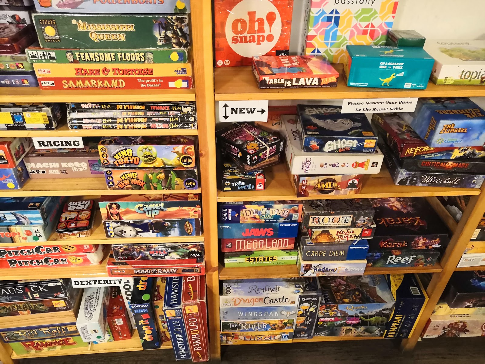
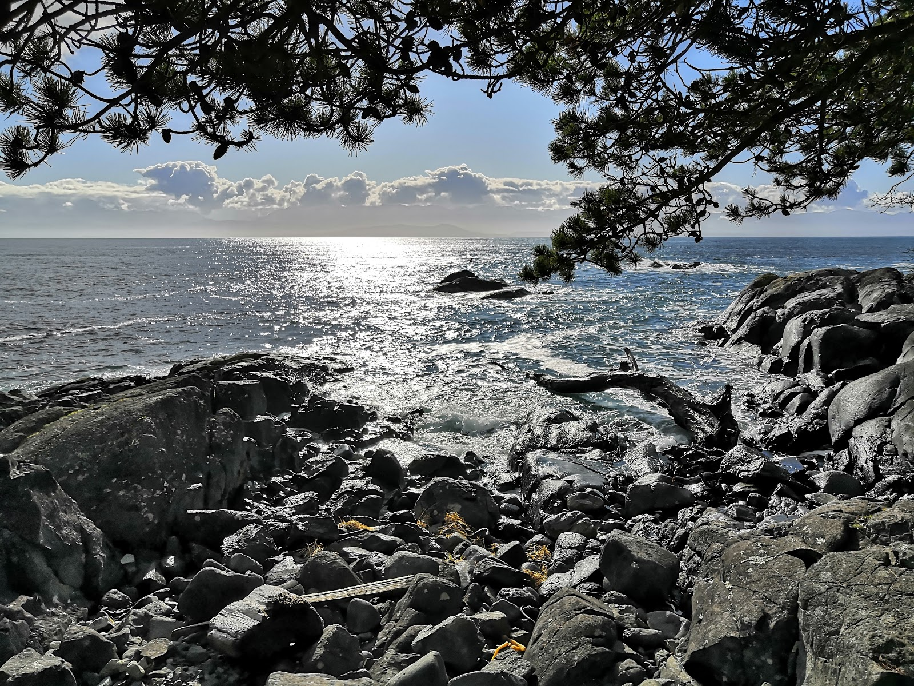
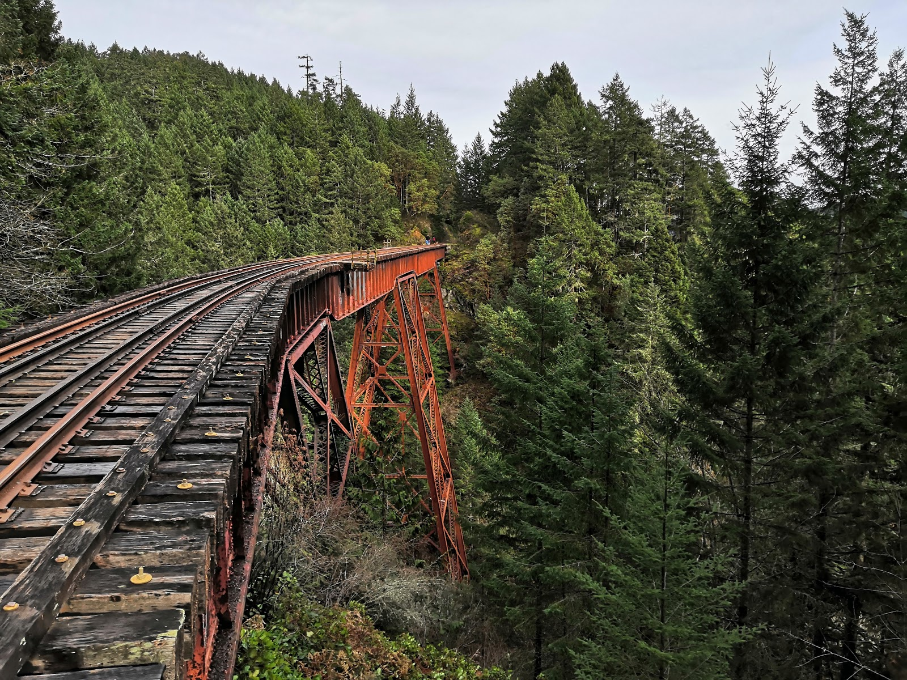

Het is nu al meer dan een maand geleden dat ik hier gekomen ben. Ik heb nog niet echt heimwee, misschien als ik een keer niks te doen heb of me een beetje down voel, maar ik probeer mezelf nog steeds veel bezig te houden (en dat lukt aardig). Deze week was ook weer erg druk, op het moment dat ik dit schrijf ben ik best wel moe, maar wel een hele leuke week weer.

Maandag heb ik voor het eerst hout gehakt, het voelde heel Canadees en was een goede workout. Ik heb het later nog een paar keer gedaan, want het blijkt erg leuk te zijn. Verder heb ik maandag vooral rustig aan gedaan en heb ik 's avonds met Gijs wat Netflix gekeken.

Dinsdag was er een klimworkshop. Het was mijn derde keer klimmen, dus ik kon wel wat tips gebruiken. Ik had verwacht dat het erg druk zou zijn (het kostte $15, en je kreeg een gratis Vikes Climbing Club T-shirt), maar we bleken met zijn tweeën te zijn. Mijn workshopgenoot was alleen erg stil, en leek wel meer ervaring te hebben dan ik, dus ik kreeg bijna persoonlijke begeleiding. We leerden wat over "grip-types" en ik heb daarna nog wat algemene tips gekregen. Daarna was het weer tijd voor Trivia night in Felicita's Pub, waar ik met zere armen heel hard verloren heb omdat het thema Oscars was en alle rondes over films gingen.  
Woensdag heb ik met Maaike (een meisje uit Nederland dat al haar hele leven in Noorwegen woont) gechilld in mijn tussenuren, en hebben we het een beetje gehad over reizen enzo. Ze ging ook mee met Sara en mij naar de Burger night (nog steeds vast programma want ik moet bij de bandrepetitie zijn). Daarna had ik weer een (redelijk korte deze keer) bandrepetitie, waarna we weer naar Dairy Queen zijn gegaan. Deze keer besloot ik maar een mini Blizzard te halen, want de kleine was al bijna te veel om op te krijgen.  
Donderdag heb ik weer geklommen, deze keer weer met Sarah Jane, want haar pas werkte nu wel weer. Dat was misschien een minder goed idee, want mijn handen en armen deden nog pijn van dinsdag. We waren dan ook niet te lang gegaan, en hebben daarna nog even samen gegeten. Er was een "yoga rave" aan de gang in de sporthal, maar de deuren waren al dicht, en we hadden uiteindelijk allebei niet heel veel zin om dat te doen. Daarna had ik eigenlijk weinig plannen, en overwoog ik eerst om te vragen of John en Sara naar de karaoke wilden, maar Gijs vroeg of ik mee wilde naar de CANOE samen met Paul en zijn vriendin, dus besloot ik dat maar te doen. De vriendin van Paul had een auto gehuurd, dus we konden er makkelijk komen, en nadat ik een biertje op had bleek dat er een hoop andere internationale studenten ook waren. Een aantal daarvan blijken ook mee te gaan naar de Big White ski trip volgende week.

Vrijdag had ik mijn eerste midterm voor het webdesign vak dat ik hier ook volg. Tot nu toe is het best makkelijk, dus ik was binnen 10 minuten de zaal weer uit. Dat kwam goed uit want ik moest nog langs het kantoor van een van mijn andere docenten om een opdracht in te zien die ik nog niet terug gehad had. Die dag kwam er ook een man vertellen over een "BattleSnake" wedstrijd in Victoria, waar je een AI kan schrijven voor het spel BattleSnake, die dan tegen anderen zou strijden. Ik had het erover met een van mijn klasgenoten, en misschien gaan we wel meedoen.

Vrijdagavond zouden John, Sara en ik met Maaike naar Downtown gaan om te eten bij la Furniture Warehouse en naar het Boardgame Cafe te gaan. John bleek een hoop huiswerk te hebben dus die zou later nog langs komen, en Veera ging uiteindelijk ook mee. Ik had geen fooi gegeven bij het restaurant, omdat ik dat toch nog niet helemaal gewend ben, en op de campus doe ik dat ook niet echt, en de serveerster werd toen helemaal boos. Super raar was dat, maar ja we gingen toch weer door. John kwam weer bij ons toen we eenmaal in het Boardgame cafe zaten, waar we milkshakes met drank hadden besteld. Die vielen toch wat slecht (zuivel met drank is denk ik een slecht idee), en ik zat met een zere maag in de bus terug naar huis. Daar wilde ik een beetje op tijd naar bed, want zaterdag zou ik met Maaike, een van haar huisgenoten en twee vriendinnen van hun naar East Sooke Park gaan.

Nadat ik zaterdagochtend op tijd was opgestaan en naar Downtown gebusd was deden we dat dan ook. Na ongeveer een uur rijden kwamen we aan in East Sooke Park, waar we een wandeling langs de kust hebben gemaakt. Nadat we door het bos weer terug zijn gelopen, en daarna terug gereden waren hebben we nog falafel gegeten bij een restaurantje in de buurt en ben ik daarna naar huis gegaan.

Ik was wel een beetje moe, en zondag moest ik weer vroeg opstaan, dus ik wilde even een rustig avondje op de bank. Dat lukte aardig, een beetje Netflix gekeken met Gijs en pizza gegeten, toen Jimena ineens binnenkwam met 5 Spaanse vriendinnen. Ik had niet echt zin om te socializen, maar ze wilden een spel spelen, dus dat deden we even, tot er ineens nog een stuk of 7 Spaanse mensen binnen kwamen. Gijs, ik en Tosca die toen ook binnengekomen waren besloten maar om nog even in het Solarium wat The Office te kijken en om daarna naar bed te gaan. We stuurden de onverwachte gasten naar het solarium en konden toen toch een goede (hoewel korte) nachtrust pakken.

Vanochtend moesten Gijs en ik namelijk om half 7 ongeveer opstaan om op tijd bij de uni te zijn voor een excursie naar Goldstream. Nadat we dachten de bus gemist te hebben waren we op tijd, en konden we vertrekken naar het park. We hadden nog even wat gegeten en gedronken bij een Tim Hortons onderweg, en hebben daarna de rest van de dag in het park doorgebracht.

Goldstream is bekend om 2 watervallen, maar vooral de 2 spoorbruggen die daar lopen. Er rijden geen treinen meer, dus je kan gewoon over het spoor lopen. De twee bruggen zijn ongeveer 100 meter hoog, en je kan door de dwarsbalken heen kijken, dus dat is spannend, maar het levert wel hele mooie fotos op. Vanavond weet ik nog niet zo goed wat ik ga doen, maar ik wil in ieder geval op tijd naar bed. Eigenlijk moet ik ook nog even voor mijn midterms komende week wat doen, maar daar heb ik eigenlijk niet zo veel zin en energie voor.

Deze week was er ook nog wat gedoe met het plan voor Reading Break. Ik zou de zaterdag nog met John, Sara en Veera in Vancouver doorbrengen, maar ineens waren er nog 2 mensen die ik een beetje kende, maar niet heel goed (en eerlijk gezegd voel ik ook niet echt een connectie met die mensen) bij het plan betrokken zonder dat ik het wist. Ineens moesten de plannen gewijzigd worden, en Sara en ik waren behoorlijk gefrustreerd. Uiteindelijk is het wel goed gekomen, maar we hebben het er wel over gehad dat als we weer wat plannen dat er dan niet zomaar ineens, lastminute, random mensen bij moeten komen. Het is dat ik er maar 1 dag bij ben, maar anders was ik wel behoorlijk pissig geworden.

Verder heb ik me de afgelopen week ook af en toe wel een beetje down gevoeld. Ik weet niet precies waarom, maar ik denk dat ik elke week op maandag wat meer down ben, het dan steeds beter gaat, ik in het weekend een beetje piek en dat eigenlijk gewoon geen zin heb in college enzo. Op dat soort momenten mis ik thuis wel een beetje, maar aan de andere kant probeer ik nog steeds heel veel te genieten (wat aardig lukt), en heb ik het nog steeds heel erg naar mijn zin hier.
