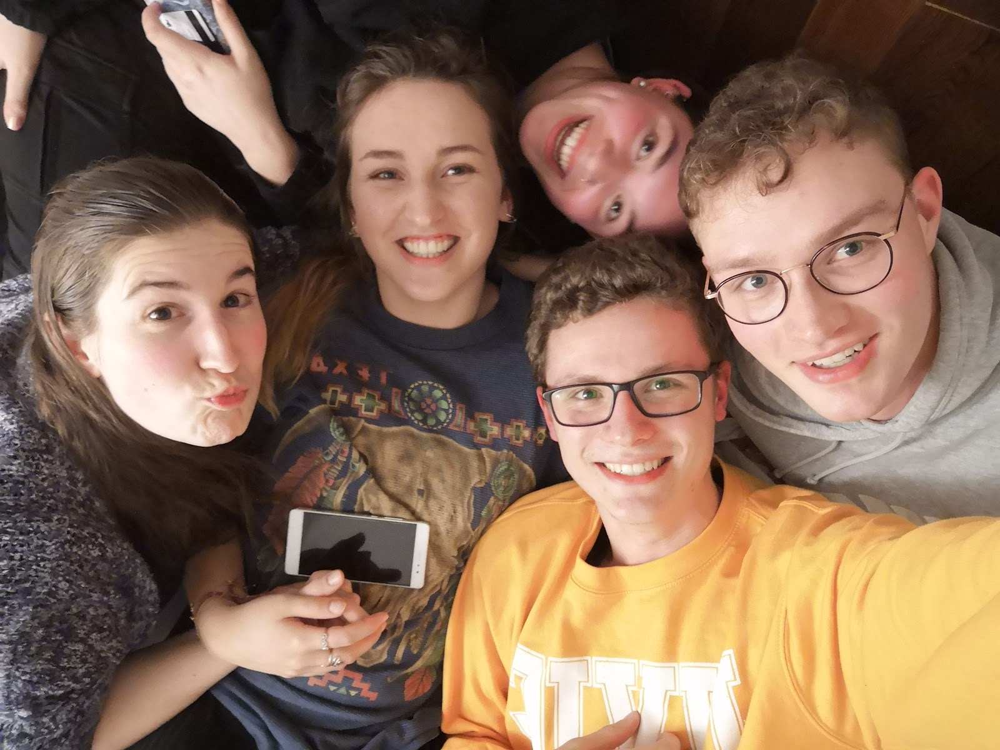
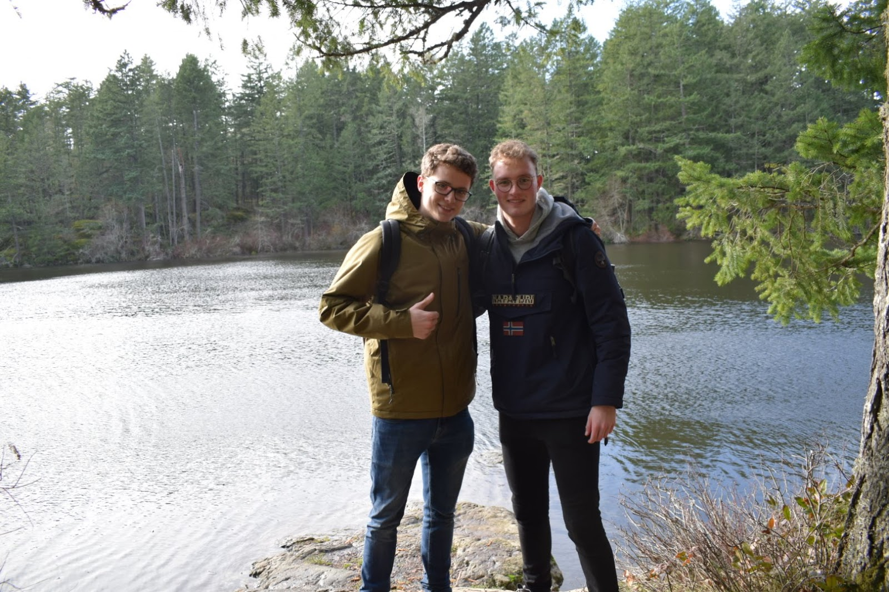
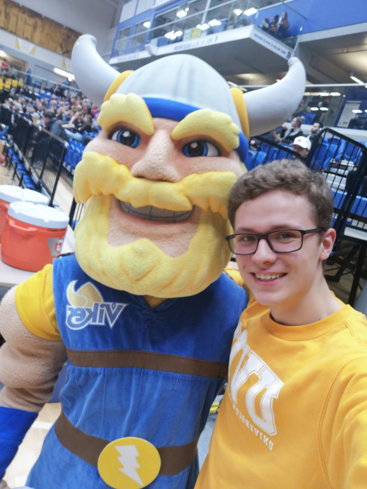

Deze week was weer enerverend. Maandag voelde ik me heel erg down, het skiën was voorbij, het regende en colleges waren weer begonnen. Nadat ik 's avonds door de regen naar huis was gefietst heb ik met Gijs, Tosca en Paul een film gekeken, en daarna nog wat Dudesons op YouTube (zij wilden Jackass zien, maar van mijn ex-collega Pepijn had ik van deze Finse heren gehoord). Dat maakte me weer wat vrolijker, een rustige, gezellige avond op de bank met chips in mijn hand.

Dinsdag zouden John, Sara en ik naar de trivia avond gaan in Felicita's Pub. Daarvoor had ik een midterm voor mijn vak in Java. Het was mijn eerste toets voor een programmeervak, en mijn eerste toets in Victoria, dus dat was vreemd. Code nalopen en code met de hand schrijven had ik beiden nog nooit gedaan. Daarna dus trivia in Felicita's, samen met John, Sara en Veera (oftewel, John and the Europeans). Ondanks het feit dat we flink verloren had was het nog steeds leuk.

Woensdag was het weer burgernight bij Felicita's, dus na college zouden we daarheen gaan met Sara, John en Veera. Zij hadden het heel druk met schooldingen, dus ik heb wat YouTube gekeken in de "body-chairs" beneden in de bibliotheek (een soort hele comfortabele ligstoelen). Tijdens het eten hadden we het even over plannen voor Reading Break (bedoeld voor het bijlezen van je vakken, maar veelal gebruikt voor vakanties). Ik had de optie om te gaan skiën met de Snow club, maar ik wilde ook heel graag met John en Sara weg. Uiteindelijk hadden we niet veel besloten behalve dat we graag naar Whistler wilden in een weekend (of lang weekend). Een paar dagen daarvoor hadden zij van een aantal mensen uit Calgary gehoord dat die terug naar Calgary gingen en dat we mee konden. Toen een van die mensen vertelde dat hij met zijn ouders ging skiën bij Lake Louise vroeg ik of ik daarbij mee mocht (als dat had gemogen had ik dat zeeeeeker weten gedaan), maar helaas was het niet zijn beslissing en ging dat waarschijnlijk niet lukken. Daarna was er weer een bandrepetitie, waar we vroeg klaar waren, en dus maar naar de Dairy Queen gingen. Ik vroeg wat de beste "Dairy Queen Experience" was, omdat ik nog nooit naar een Dairy Queen was geweest. Ik had uiteindelijk een kleine (bij naam, maar niet bij volume) Smarties Blizzard. Toen ik die als laatste op had gingen we door naar de Mac, waar Marissa en Justine patat hadden besteld. Deze bleek koud te zijn, dus kregen we na een klacht nog 2 extra porties, waarna ook Jay en ik dus patat hadden.

Donderdag zag ik plots dat het aantal open plekken voor de Reading Break excursie van de Snow Club van 13 naar 9 was gezakt en had ik maar besloten om me dan toch daarvoor op te geven. Ik vertelde het aan John en Sara over WhatsApp en die zeiden dat zij uiteindelijk toch graag naar Vancouver wilden gaan omdat daar een concert speelt. Omdat de Snow Club vanuit Vancouver vertrekt op zondag kan ik dus (hopelijk) nog met hun Vrijdagavond en Zaterdag naar Vancouver, en pakt het dus toch goed uit. Daarna zou ik weer gaan klimmen met Sarah Jane, maar zij werd om de een of andere reden niet binnengelaten en zou extra moeten betalen. Ik heb dus maar zelf een half uurtje, drie kwartier geklommen en vond het toen wel goed. Komende dinsdag stond er een workshop klimmen voor beginners gepland, dus daar heb ik me maar voor opgegeven, want het klimmen ging donderdag een stuk minder goed dan vorige week. En ik krijg er een T-Shirt, dus dat is de $15 al waard. Daarna ben ik met Gijs, Tosca, Sophie en twee vriendinnen van Sophie naar de CANOE Brewpub downtown geweest. Sophie is zaterdag naar Vancouver gegaan om door te gaan naar huis, dus we moesten volop gebruik maken van de tijd dat ze nog in Victoria was. Voordat we weggingen hadden we al wat drankjes op, en daar werd de avond alleen maar gezelliger. Uiteindelijk hebben we daar een hele leuke avond gehad en heb ik twee bekers gestolen, die nu nog op mijn kast staan.

Vrijdag had ik pas om half 2 college (ik plan wel wanneer ik uit wil gaan), maar Gijs had zich wat extra tijd gegund 's ochtends om wat uit te brakken. Na mijn colleges had ik snel wat patat gehaald en ging ik door naar mijn eerste performance van de Vikes Band. We speelden bij een basketbalwedstrijd tegen Manitoba. De eerste quarter hadden we niet heel veel te spelen, maar het was ook een hele ervaring. Met het volkslied aan het begin, cheerleaders, een commentator en spelletjes gedurende de wedstrijd voelde het allemaal heel Amerikaans aan. Daarna kreeg ik een lift van de "bandmoeder", en mijn medetrompettist Marissa (zoals haar reputatie is) naar huis, wat heel goed uitkwam want het regende heel hard. Daarna hebben we met Tosca, Gijs, Sophie en Maddy (een van de vriendinnen van Sophie) nog de hele avond gechilld.

Zaterdag moesten we dus afscheid nemen van haar, maar ze had wat haast om de ferry te halen, wat jammer was. Daarna zijn Gijs en ik naar Thetis Lake gegaan. Een klein stukje buiten Victoria, maar met de buspas van UVic nog steeds goed (en gratis) te bereizen.

Toen we daar een stuk hadden gelopen en weer terug waren gegaan zijn we nog langs de supermarkt gegaan en moest ik daarna eigenlijk bijna meteen weer door naar de uni voor de volgende performance van de Vikes Band. Het was de laatste game van het seizoen, dus het was druk. Deze keer geen cheerleaders, maar de mascotte van de Vikes, Thunder, was er wel.

Nadat we een hoop gespeeld hadden, en ik twee stukken pizza (met korting omdat ik in de band zat) op had gegeten was het klaar met het optreden, en ging ik met Sara, John, Mitchell en Kath naar de film, "Parasite", een Oscar-genomineerde Koreaanse film in de bioscoop op de campus (Cinecenta). Ondanks het feit dat ik best moe was had ik de film overleefd, overigens zeker het kijken waard! Ik was met de bus gekomen, en wilde het sowieso niet laat maken, dus ik had mijn spullen gehaald uit Sara's dorm en nog even met hun wat nagepraat, en ben toen naar de bushalte gelopen. De bus was te vroeg, en mijn telefoon was leeg dus ik moest wachten op de volgende. Ik had een half uur in het Campus-security huisje gezeten, oefenend om een wenkbrauw op te trekken (wat ik nog steeds niet kan). Toen ik eindelijk thuis aankwam ging ik maar snel naar bed en kon ik vandaag eindelijk uitslapen.

Vandaag doe ik maar wat rustiger aan. Gister is een nieuwe huiswerkopdracht gepost voor een van mijn vakken, en verder ga ik vandaag alleen mijn was doen en ontspannen denk ik. Misschien hout hakken voor mijn huisbaas, want t lijkt me best leuk om dat een keer te doen, maar ik weet niet of hij vandaag hier nog komt.
