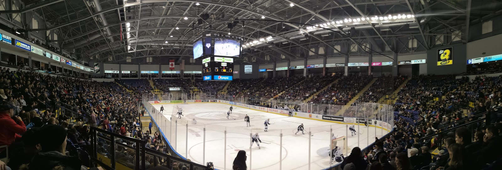

Mijn tweede volle weekend in Victoria zit er weer op. Zoals ik dat thuis ook altijd doe probeer ik zo veel mogelijk alles voor school gedurende de week af te krijgen, zodat ik in het weekend vrij heb. Vrijdag was Tosca jarig. Ze had een aantal mensen uitgenodigd naar het huis. Ze wilden een spel spelen, en ik heb eerder Mao gespeeld met het huis, en ze vonden het wel leuk om dat ook met de nieuwe gasten te spelen. Het werd steeds drukker, maar ondanks dat konden sommige mensen toch nog wel de regels achterhalen. Al gauw werd het iets te druk en besloten we een ander spel te spelen. De dag daarna zou ik met Sara en Sophie naar Goldstream park gaan. Daar is een brug met spoorrails erover die heel mooi schijnt te zijn. We hadden geen auto, dus moesten met de bus gaan, en waren eerst in Goldstream gaan lunchen. Dat was al heel leuk, maar de poutine die ik had besteld was veel te groot, dus de rest nam ik maar mee om later als diner op te eten. We hadden het ook niet helemaal goed uitgepland, want we konden niet in een redelijke tijd naar de brug komen. Dat zou een hike van 2 uur zijn een kant op, dus hebben we maar wat rondgelopen door het bos daar, en zijn we daarna met de bus weer terug gegaan. Daarna hebben we nog wat door Downtown Victoria gelopen, en gingen we daarna terug naar huis. Er zou die avond een feestje zijn bij een van de cluster houses op de campus waar we voor uitgenodigd waren, dus eerst nog even eten enzo.

Toen ik thuis kwam vroeg Paul of we naar een ijshockeywedstrijd wilden gaan. Natuurlijk was dat een van de dingen die ik in Canada heel graag wilde doen, en de rest van het huis ging ook mee, dus dat was extra gezellig. IJshockey was wel een beetje een vage sport, het leek soms meer om het vechten te gaan dan om de hockey zelf, maar het was wel mooi om een keer mee te maken. Er werden de hele tijd muziekfragmentjes tussendoor gespeeld, of dingen gedaan op het grote scherm in het midden (kiss cam dingen enzo). Daarna ging ik door naar het feestje. Toen ik na een paar keer vragen het huis gevonden had, werd ik al door een paar dronken mensen begroet. Ik werd naar binnen geleid, en kreeg een drankje aangeboden. De meid die me buiten begroette wilde duidelijk wat van me, en noemde me zelfs hot op een gegeven moment. Het drankje dat ze me aanbood was overigens niet te drinken, dus dat maakte de situatie nog wat moeilijker. Uiteindelijk wist ik van haar weg te komen en heb ik de rest van de avond vooral gepraat met Veera, Maaike en Sara. Iedereen ging ook vrij vroeg weer weg. Het moet rond 00:00 weer stil zijn op de campus volgens mij, dus iedereen ging rond die tijd weer naar huis. Uiteindelijk waren wij als laatsten over om 2 uur, en besloten we er toch ook maar een einde aan te breien.  De dag daarna heb eindelijk maar eens uitgeslapen, en ben ik nog even naar Victoria downtown geweest. Eerst om te lunchen met Gijs en Sophie, en daarna nog even rondgelopen met Sara. We zouden eerst gaan schaatsten, maar de schaatsbaan was dicht of bezet dus die plannen gingen niet door.

Gister was John eindelijk weer een beetje levend, dus hebben we met zijn drieen wat gepraat over wat we willen doen met "reading break" (soort voorjaarsvakantie). Ik heb zelf geen idee wat leuk is om te doen, dus het plannen was wat lastig, maar we hebben nog eventjes, dus dat komt vast goed. Gisteravond was ik naar de stad gegaan met Sophie en Gijs, wat misschien een iets minder goed idee was, want vanochtend kon ik mijn bed niet uitkomen en kwam ik bijna te laat voor mijn lessen.

Alles begint hier wel te wennen, dus das fijn aan de ene kant, maar wel jammer dat het toch wat minder speciaal voelt soms. Ik moet nog steeds maar proberen niet te veel bij dat soort dingen na te denken.
