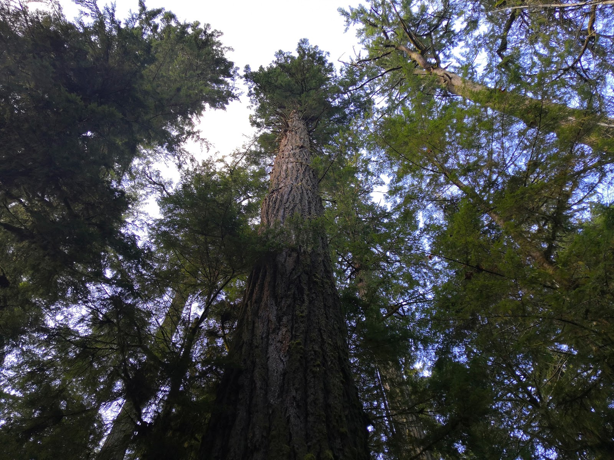
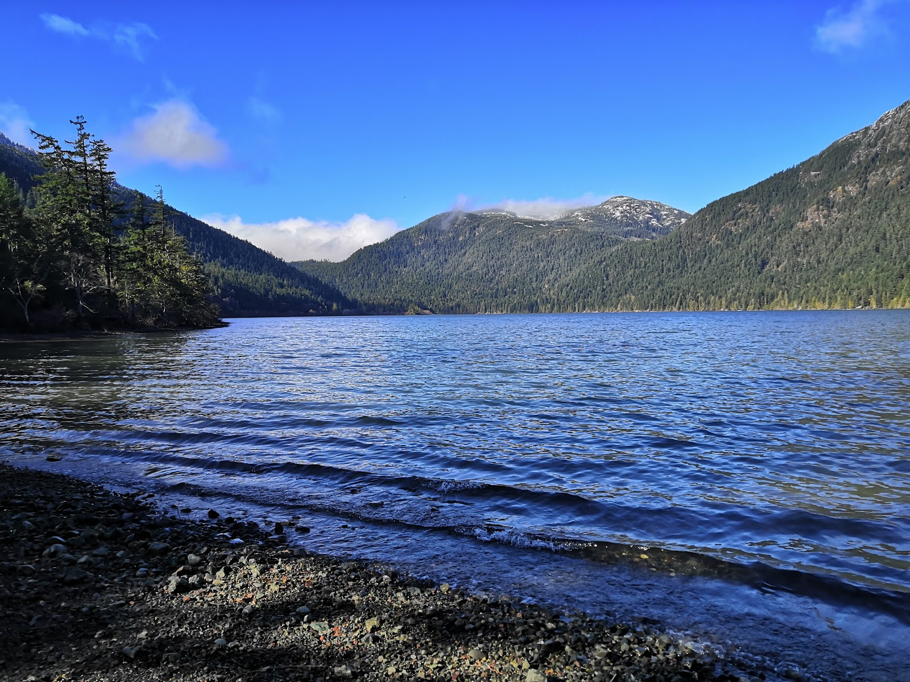
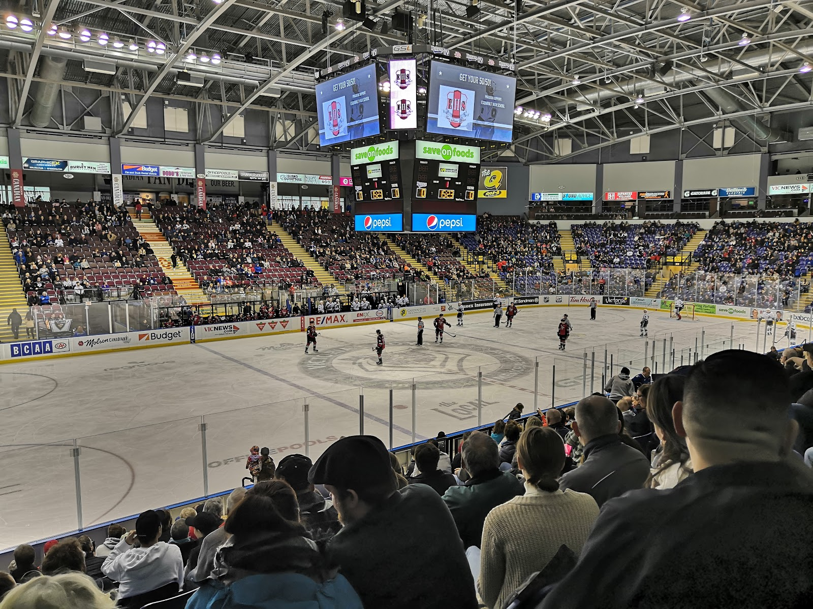

Man man man wat gaat de tijd toch snel. Het is alweer 4 maart, nog maar een maand totdat de finals beginnen. Er is nog zo veel dat ik wil doen en zien, en nog zo weinig tijd om het te doen. Ik ben van plan nog naar Whistler en Seattle te gaan voordat de finals beginnen, en dan na de finals wat verder weg te gaan.

Afgelopen week was weer druk, alles begon weer. De eerste paar dagen voelde ik me wat minder goed omdat de skitrip voorbij was. Ik moest leren voor de midterm van het lastigste vak dat ik heb, wat wat minder succesvol verliep. Op de midterm stond een vraag waar geen van de 4 mensen in dat vak het antwoord op wist. Uiteindelijk had ik voor deel b van die vraag nog wat gedaan waar ik punten voor kreeg, en kwam ik op 75% uit, wat uiteindelijk nog omhoog gecorrigeerd zal worden door de professor omdat de rest de midterm ook niet al te best had gedaan.

De dag daarna ben ik naar de kapper gegaan downtown, wat ook een hele ervaring was. Van tevoren vond ik het eerlijk gezegd een beetje gek, want ja het is hier natuurlijk ook anders. Paul omschreef me hoe het bij de kapper die hij aanraadde ongeveer ging: "You sit down on a bench with a bunch of dudes waiting until its your turn. Then when it is your turn, you sit down on one of the turning chairs, you tell the barber what you want, and they turn you away from the mirror, facing the dudes. Then they they cut your hair and turn you back towards the mirror once you're done." Dat was dan ook ongeveer precies hoe het ging. Daarna had ik met Maaike afgesproken in dezelfde straat als dat de kapper was, om het zetten van haar tattoo bij te wonen. Een bijzondere ervaring ook. Ze had ook een vriendin die langskwam die over haar reis naar Toronto ging vertellen, waar we ideeën van kregen om na het semester met elkaar te reizen. Die avond had ik nog een midterm, waar ik eigenlijk niet veel voor had voorbereid. Het was voor het Java-vak, dus dat zou wel goedkomen, en op wat ruimtetekort na was dat ook wel zo. Die avond zijn we weer naar Trivia gegaan met ons vaste team (met nu ook vaste teamnaam Hot Stuff), alleen kon Veera niet. Dat resulteerde in een historisch lage score en wat teleurstelling, maar desalniettemin een leuke avond.

De avond daarna hadden we weer bandrepetitie, waarna we een nieuw fastfoodrestaurant hadden uitgeprobeerd: A&W. Daar hadden ze een Coca-Cola freestyle apparaat, heel gelijkend aan degene die ze hadden bij de Wendy's toen we terug gingen van de skitrip bij Mt. Washington. Ik kon dus weer Cola Cherry & Vanilla drinken, wat echt de beste smaak Cola ooit is.

Donderdag kon ik niet klimmen, want ik wilde mijn knie niet verder kapot maken. Onderhand gaat het trouwens een stuk beter daarmee. Ik kan alweer normaal lopen, alleen nog niet rennen maar daar houd ik toch niet echt van. Die donderdag was ik dus maar meteen naar huis gegaan na college, wat voor het eerst is volgens mij. Ik ben samen met Gijs naar hillside mall gegaan, en ben ik daarna vreemd uitgeput maar op tijd naar bed gegaan.

Vrijdag gingen we dan wat drinken met de mensen van de skitrip. Het was heel leuk om weer met hun allemaal bij elkaar te zijn, zeker omdat ik me nu ook wat comfortabeler voelde om een paar biertjes meer te drinken dan op de skitrip (dan wil ik natuurlijk niet brak zijn en kostbare skitijd missen). Uiteindelijk was ik van de bus afhankelijk, en kon ik pas ("helaas") om 2 uur naar huis.

De dag daarna hadden Gijs en ik ons weer opgegeven voor een tripje met de Photography Excursion Club (PEC), naar Port Alberni en Cathedral Grove. Ik kende onderhand een paar mensen daar, dus dat was extra gezellig. We moesten wel half 7 opstaan daarvoor, dus het was wel vermoeiend.

Die avond was ik ook uitgenodigd voor een feestje (met Australisch thema), dus op tijd naar bed kon ook niet echt. Een dutje van tevoren maakte de vermoeidheid alleen maar erger, maar ik had het nog steeds naar mijn zin bij het feestje.

De dag daarna zou ik met John en Sara naar downtown gaan om een beetje dingen te zien. Uiteindelijk had John weer veel te doen voor zijn vak over de bijbel, dus kon hij pas later aanschuiven. Sara en ik gingen dus in de middag eerst een ijsje halen bij een ijssalon genaamd Perverted Ice Cream, waar ik een ijsje bestelde met een condoom erin. Toen we daar binnen waren liep er ook een gezinnetje naar binnen, die verbaasd naar het ijs keken dat ze daar verkochten. Het leek me niet de beste ijszaak voor het hele gezin, maar ach. Daarna zijn Sara en ik naar een Victoria Royals ijshockeywedstrijd geweest, die Victoria won van Vancouver.

Niet al te veel gevechten, maar nog steeds een leuke wedstrijd. Daarna gingen we samen met John erbij eten in de Cactus Club downtown, die ik er heel chic uit vond zien, maar dat bleek uiteindelijk mee te vallen. Daarna voegde Maaike zich ook bij ons en hebben we een "Ghostly Walks" tour gedaan rond het oude gedeelte van Victoria. Een gids vertelde ons "waargebeurde" spookverhalen die ze gevonden hadden via de archieven van Victoria, en via waarnemingen van burgers van de stad. Daarna hadden we nog een drankje gedronken in een café dat de gids aanbevolen had, en toen was het weekend weer voorbij.

Maandag was er een inschrijving voor een surftrip naar Tofino, een bekend surfersplaatsje op Vancouver Island. Voor de inschrijving moest je zo snel mogelijk naar een locatie gaan die om 7 uur 's avonds aangekondigd werd. Ik besloot te rennen samen met twee mensen die ik op de skitrip heb leren kennen. Ik had geluk, want een van hen was achter de locatie gekomen en we waren een van de eerste bij de inschrijving. Dat betekent dus in ieder geval dat ik komend weekend weer wat te doen heb.  
Gister was het dan weer tijd voor Trivia, waar we deze keer niet al te slecht gescoord hadden. 4e of 5e van 10 teams. Bijna prijs dus. Vandaag weer bandrepetitie, waarna we hoogstwaarschijnlijk naar de Dairy Queen gaan omdat mensen daar kortingsbonnen van hadden. Verder heb ik de afgelopen dagen veel aan mijn BattleSnake gewerkt. De wedstrijd is immers op 15 maart, dus ik heb na deze week nog een weekje om eraan te werken. Als mensen de score van mijn slang willen bijhouden: het is te zien op [de leaderboards van BattleSnake](https://play.battlesnake.com/leaderboard/), en op de dag van de wedstrijd wordt het ook gestreamd op Twitch!

Ik merk dat ik af en toe bijna een beetje gestresst wordt van hoe snel de tijd gaat, maar ik heb het in ieder geval nog naar mijn zin dus dat is goed.
