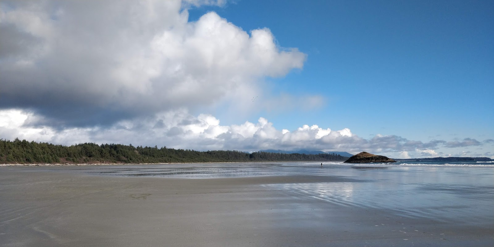
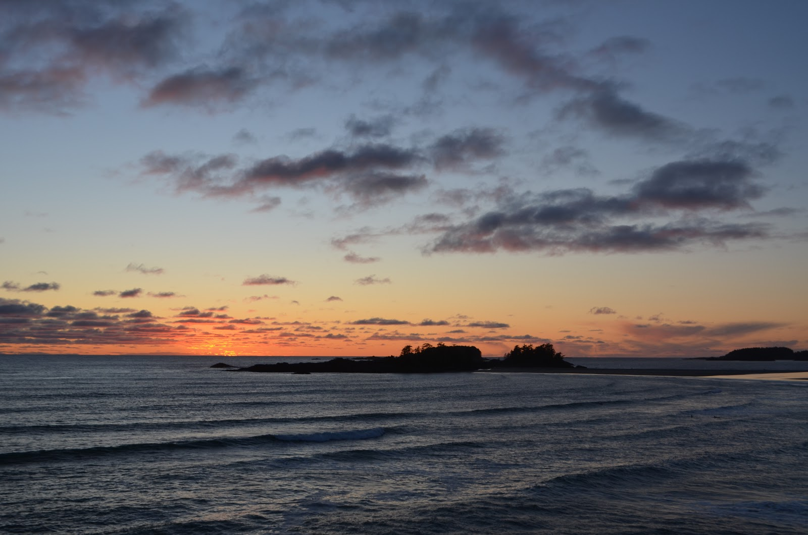
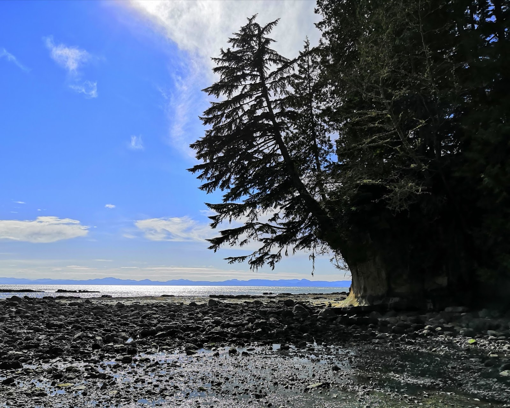
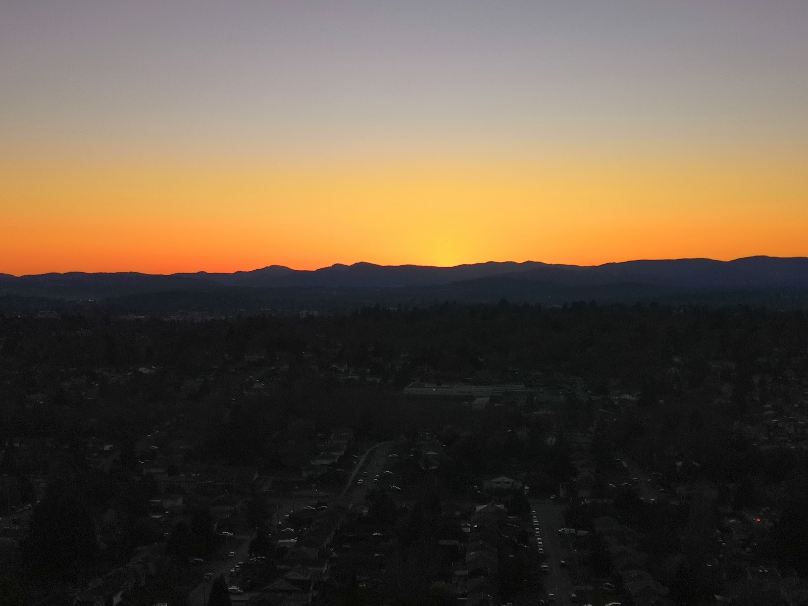
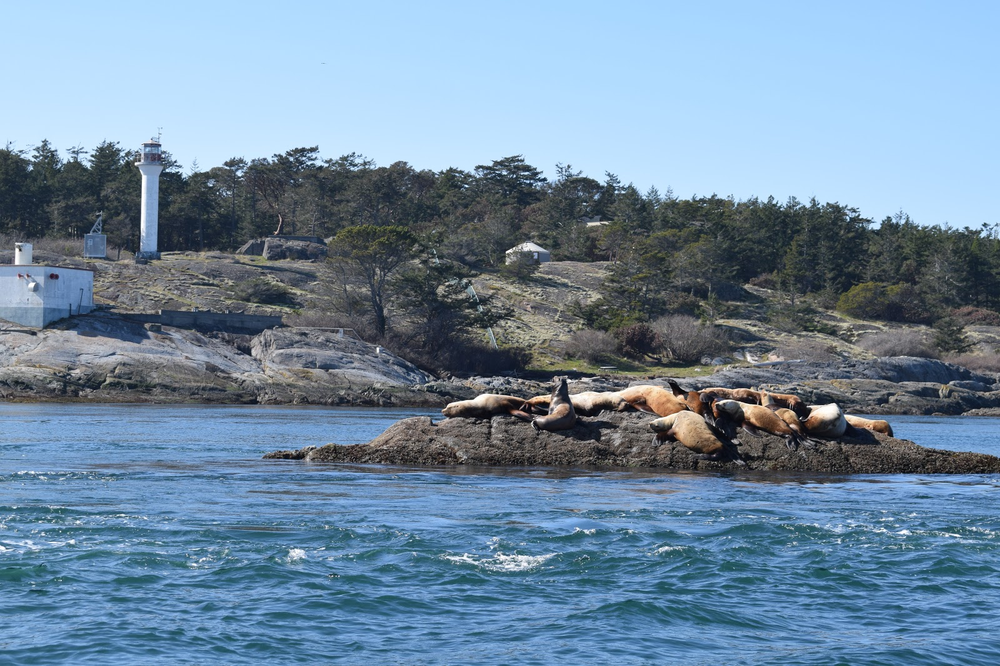
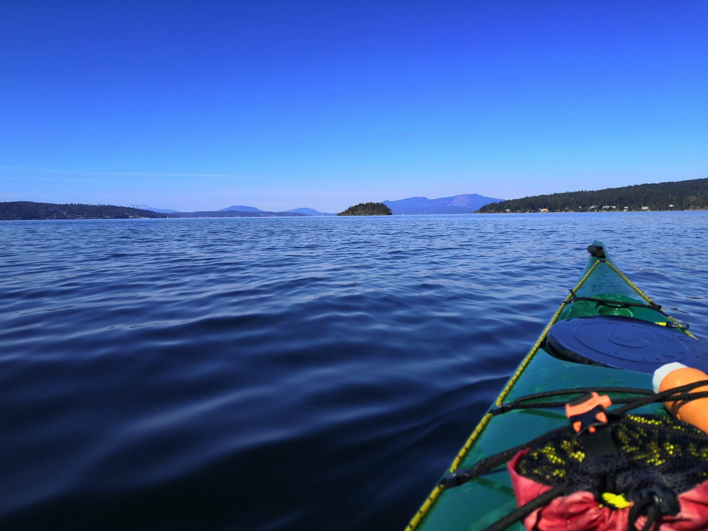

Het is al een tijdje geleden dat ik de vorige blog heb geschreven. Sinds toen is de situatie rond het Coronavirus een beetje geexplodeerd, en heb ik niet veel tijd gehad om nog veel te schrijven. Sinds de vorige blog ben ik een weekend wezen surfen in Tofino, een surfersdorpje dichtbij Victoria. De rit ernaartoe was al een heel avontuur, met prachtige uitzichten. Zaterdagochtend gingen we naar de surfverhuur, kregen we onze spullen en gingen we naar het strand. Het sneeuwde zaterdagochtend, dus het was nogal koud, maar daardoor niet minder leuk. Na het surfen zijn we nog even naar een ander strand gegaan, Long Beach, dat zoals de naam weggeeft erg lang is.

Die avond zijn we ook naar de zonsondergang wezen kijken op het strand, een van de mooiste die ik daar gezien heb!

Daarna zijn we nog met de hele groep naar een ander strandje gelopen en hebben we daar rond een kampvuur gezeten. De dag daarna ging het surfen een stuk beter: ik kon zowaar twee keer opstaan op mijn board. Nadat het surfen die dag voorbij was gingen we weer terug naar Victoria. Onderweg zijn we nog bij het dorpje Ucluelet gestopt en hebben we daar een korte wandeling gemaakt.

Daarna begonnen veel dingen afgelast te worden. Die donderdag werd bekend gemaakt dat UVic het aan de docenten zou overlaten of colleges online of in het echt gegeven zouden worden, en vrijdag werd bekend gemaakt dat alle colleges afgelast zouden worden. Dat weekend besloten ook al veel mensen om naar huis te gaan, uit angst dat ze daar later niet de mogelijkheid toe zouden hebben. Dat weekend zijn we met de huisgenoten nog op een tripje naar Botanical Beach en Avatar Grove geweest.

Toen we thuis kwamen werd steeds meer duidelijk dat het waarschijnlijk steeds minder zin had om daar te blijven. Tegen die tijd was ook BattleSnake afgelast. Die avond was ik uitgenodigd voor iemands verjaardag en voor het feestje van iemand die twee dagen daarna weg zou gaan. Ik was dus bij haar feestje tot zij op een gegeven moment twee keer gekotst had en op de grond was gaan slapen. Daarna ging ik naar de verjaardag, waar nog een aantal mensen waren die toen nog zouden blijven. 

De dag daarna moest ik afscheid nemen van Sara. Ik had die nacht op de campus geslapen bij John op de grond (voor zover dat lukte), dus ik was behoorlijk moe. Die dag heb ik dus maar nog wat geprobeerd te slapen in de bibliotheek. Die dag begon onze huisbaas ook nogal paranoïde te worden. Hij zei dat we niet meer het huis uit mochten zonder dat hij wist waar we waren, en dat we niet meer de bus mochten nemen. Ik wilde niet dat hij mijn tijd daar zou verknallen, of ik nou lang nog zou blijven of niet, dus besloot de dag daarna maar weg te gaan uit dat huis, en (tijdelijk) de kamer over te nemen van een vriendin van me die die dag was weggegaan. Uiteindelijk ben ik heel blij dat ik dat gedaan had, want die vent werd steeds gekker, en bleef maar op je emoties inspelen. 

Daarna had ik besloten om op 25 maart naar huis te gaan. Er zou niet veel meer open zijn, en er zou een kans zijn dat ik niet meer thuis zou kunnen komen. Die dag kon ik dezelfde vlucht nemen als Gijs, dus dat was fijn. Daarna waren er eigenlijk nog weinig internationale studenten die zouden blijven. Eigenlijk kende ik er nog maar 2 die niet weg wilden. We hebben die laatste dagen nog veel gedaan. Heel vaak naar de zonsondergang gekeken, eerst op Mount Tolmie. 

En we hebben veel op het strand dichtbij de campus, Cadboro Bay, gezeten. Die donderdag zijn we ook wezen Whale Watchen, alleen hebben we geen walvissen gezien helaas. Het was wel een heel leuk boottochtje, en daarna hebben we Fish and Chips gegeten bij de Fisherman's Wharf. 

en na de fish and chips zijn we weer naar een zonsondergang gaan kijken. De dag daarna hadden we een auto gehuurd en zijn we naar Mystic Beach gereden, waar we weer tot zonsondergang hebben gezeten, en daarna wilden we kijken of we een overnachtingsplek konden vinden in Port Renfrew, een klein plaatsje daar in de buurt. Helaas was alles dicht en moesten we terugrijden. We hadden de dag daarna de auto nog, dus besloten we te gaan Kayakken in een baai ten noorden van Victoria. 

De dag daarna was voor veel mensen de laatste dag in Victoria. Van sommigen wist ik het toen niet eens. We waren overdag met Eva, Gijs en Mathis naar Craigdarroch Castle gegaan in Victoria. Uiteraard was het dicht, maar we konden het nog van buitenaf bewonderen, en daarna zijn we naar Spiral beach gegaan, een strand in Victoria. Die avond hebben we met de mensen die nog over waren op de campus in iemands huis besteed.

De dag daarna ben ik nog even snel naar de campus gegaan omdat ik de avond daarvoor een fiets had geleend (met lekke band) die ik nog terug moest brengen. Daarna had ik nog even met Gijs gechilld en ben ik op tijd terug naar mijn tijdelijke huis gegaan, waar ik de rest van de avond paranormal activity films had gekeken met mijn huisgenoten. De dag daarna was eigenlijk bijzonder rustig. Ik had mijn spullen ingepakt, en hebben we de rest van de dag de andere delen van de paranormal activityreeks gekeken.

De dag daarna was het dan tijd om te vliegen. Ik had mijn bus naar de ferry eigenlijk gemist, maar er kwam er snel daarna gelukkig nog een die snel genoeg was om mijn overstap te halen. Volgens mij zaten er in totaal maar iets van 10 mensen in die ferry. Daarna met de bus en de metro naar het vliegveld, waar we met mondkapjes op gewacht hebben op onze vlucht. Ook daar was het behoorlijk leeg. Eigenlijk was ik nog bijzonder rustig in het vliegtuig vond ik, ik denk dat ik het al wel een beetje geaccepteerd had. Toch werd ik vlak voordat we in Schiphol landden wel een beetje emotioneel.

Nu zit ik thuis in quarantaine, heb ik mijn gemiste colleges ingehaald en moet ik de rest online afmaken. Het was een heel avontuur, met veel mooie en minder mooie momenten, en ik hoop dat ik snel terug kan keren om mijn reisplannen te volbrengen!
