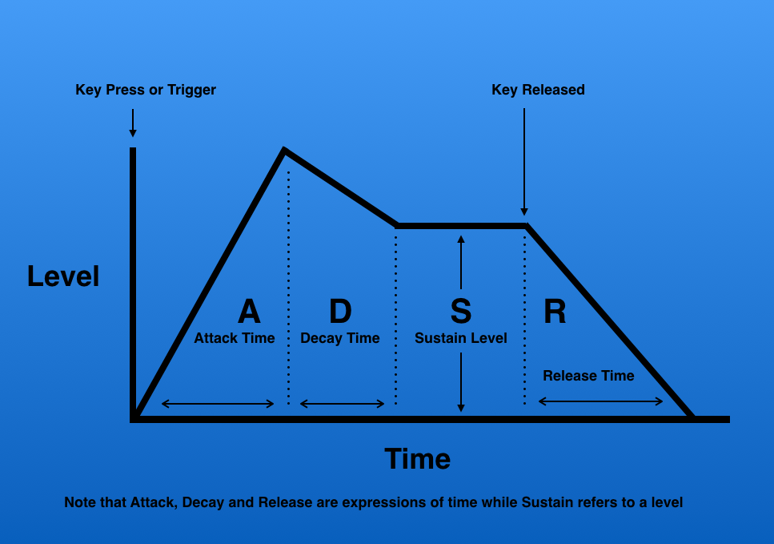
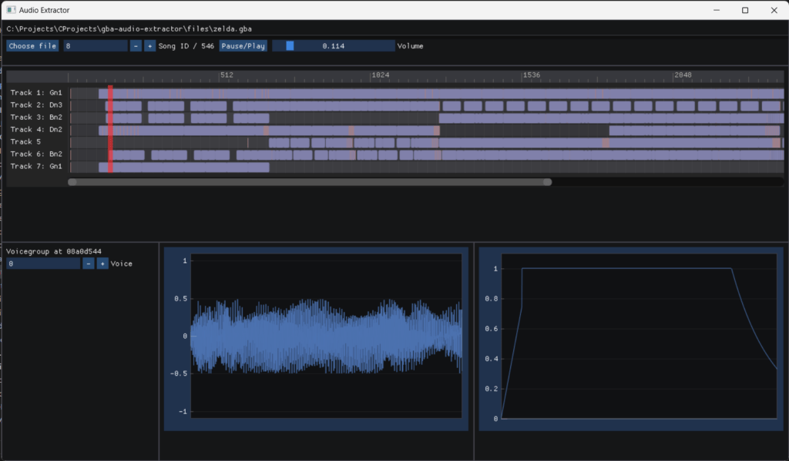

\[latexpage\]

About a year ago, I was working on [porting Pokemon Ruby](https://github.com/densinh/pret-port) from the GBA to the PC (including some [extra m4a engine decompilation work by Karaukasan](https://github.com/Kurausukun/pokeemerald/blob/54e55cf040e8ef4b11632a0af14b9f512827d92a/src/sound_mixer.c), most notably the [music\_player.c](https://github.com/Kurausukun/pokeemerald/blob/pc_port/src/music_player.c) file). After getting it working, with emulated (threaded) graphics and audio, I realized the game was not running any faster than [my GBA emulator DSHBA](https://github.com/DenSinH/DSHBA), which I found surprising, considering a native game should probably run faster (right?). After profiling the ported game, I saw that audio emulation was taking up most of the CPU resources (by far!). I figured that, considering I have all the decompiled code available, there should be a way to run the audio engine natively (and threaded!) as well.

This is why I decided to research into the m4a engine, and, particularly, how the GBA stores / plays audio. I mean, the mp3 songs you might listen to take up multiple megabytes even for one or two minutes of play time, while a GBA ROM can only store 2MB of data _total_. Of course, a highly efficient way of storing song data was used, similar to the MIDI format. Programs to export sound already exist (like [agbplay](https://github.com/ipatix/agbplay) or the [agb2mid](https://github.com/zeldaret/tmc/tree/master/tools/src/agb2mid) tool in the zelda tmc decomp, or many pret decompilation projects). I decided to write [my own GBA audio extractor](https://github.com/DenSinH/gba-audio-extractor) for the learning experience.

## The Hardware

As an emulator developer, I am aware of the GBA audio hardware to a certain extent, and know how the GBA is supposed to play audio when IO registers are written to (see [GBATek](https://problemkaputt.de/gbatek-gba-sound-controller.htm) or even the [GB Pandocs](https://gbdev.io/pandocs/Audio.html), considering the GBA uses mostly the same audio registers, besides direct audio). The GBA has 4 audio channels: 2 square wave channels, a wave channel with 32 (or 64) programmable samples, a noise channel and direct 8 bit audio. Games write to IO registers to control the channels, but how does the audio engine do this to make a song?

## GBA Sound Format

A lot of work has been done (see for example [an attempted pc port of pokemon emerald](https://github.com/Kurausukun/pokeemerald/blob/pc_port/src/m4a.c) or [agbplay](https://github.com/ipatix/agbplay)), but documentation is sparse and incomplete. I will be using code from the [Zelda: the Minish Cap decompilation project](https://github.com/zeldaret/tmc), as well as my own code to explain how everything works. The process works a bit like the following. There are 3 main m4a engine control functions:

```c
void m4aSoundInit(void);   // initializes the engine and the hardware, called on program startup
void m4aSoundMain(void);   // mixes audio samples and sends them to the direct audio controller, called regularly (every VBlank or HBlank?)
void m4aSoundVSync(void);  // triggers an audio DMA to transfer data from a buffer to the audio channels
```

Then there are some more controller functions, starting or stopping songs or sounds, controlling the master volume or other effects.

```c
void m4aSongNumStart(u16 n);
void m4aSongNumStartOrContinue(u16 n);
void m4aSongNumStop(u16 n);
void m4aMPlayAllStop(void);
void m4aMPlayImmInit(MusicPlayerInfo* mplayInfo);
void m4aMPlayTempoControl(MusicPlayerInfo* mplayInfo, u16 tempo);
void m4aMPlayVolumeControl(MusicPlayerInfo* mplayInfo, u16 trackBits, u16 volume);
void m4aSoundVSyncOn(void);
void m4aSoundVSyncOff(void);
```

These controller functions update `MusicPlayer` structs, which contain the state of a single song / sound that may be played. Some comments have been added to certain fields, which will be clear later.

```c
struct MusicPlayerInfo {
    const SongHeader* songHeader;  // songheader pointing to tracks / voice group
    u32 status;
    u8 trackCount;                 // number of tracks
    ...
    MusicPlayerTrack* tracks;      // track list
    ToneData* tone;                // voice
    u32 ident;                     // lock
    MPlayMainFunc func;
    u32* intp;
};

struct MusicPlayerTrack {
    u8 flags;          // state
    u8 wait;           // counter
    u8 patternLevel;   // nested pattern depth
    u8 repN;
    u8 gateTime;       // time to play a note for
    u8 key;            // key of the current playing note
    u8 velocity;       // velocity of the current playing note
    u8 runningStatus;  // last repeatable event (cmd >= 0xbd)

    // keyShift, pitch, bend, volume, pan, mod, lfo, echo, etc. stuff

    ...
    SoundChannel* chan;   // soundchannel to play sound on
    ToneData tone;        // voice to play sound with
    ...
    u8* cmdPtr;           // current position in command stream
    u8* patternStack[3];  // PEND return addresses
};

typedef struct MusicPlayer {
    MusicPlayerInfo* info;
    MusicPlayerTrack* tracks;
    u8 nTracks;
    u16 unk_A;
} MusicPlayer;
```

Most notably, the music player holds info on the song (a song consists of multiple _tracks_ with audio data, and a pointer to an array of `ToneData` structs, which is a table containing sound samples which the tracks may use, which we refer to as _voices_). Then there is some more random struct fields which are used to track the status of certain audio effects like panning, echo, pitch shifting etc.

This already gives some insight into how the data is stored: as _songs_, consisting of _tracks_, using certain _voices_ to play tones with different sounds. A game usually contains a table of songs, called the _songtable_ (commonly named `gSongTable` in decompilation projects. Songs contain an ID for a music player, which is then triggered to stop playing the song it was previously playing, and start playing the requested song. This means that the m4a engine can play only a limited amount of songs (and sound effects!) at the same time (commonly 32, so quite a few).

Songs consist of _tracks_ and a pointer to a _voice group_. The tracks contain the parts of the song that is played, like in a real orchestra! A track may contain music for multiple different instruments, but only one instrument (or _voice!_) is playing at once. Though a game may have many _voice groups_ stored in it's data, only one can be selected per song, and only one voice within this group can be active at a time, per track. This means that if a song contains 7 tracks, we may hear 7 different instruments at the same time! A _voice group_ is an array of _voices_. A _voice_ contains data that describes the sound of an instrument. This may be in the form of CGB audio channel controls, wave data or a direct sound sample.

So how is all the data for a song stored? Well, a track consists of a stream of _events_, which may be either a _note_, a _controller event_, or a _wait event_. Music players have an internal, regularly ticked counter, ticking down until the next events should be played, or until the counter is incremented again by a _wait_ event. Let us briefly look at my own implementation for the data in a song. The data defined as below. Note that this does _not_ contain any information for actually _playing_ a song, we will look into that later.

```cpp
struct Event {
  enum class Type {
    Meta = 0,
    Goto, Tempo, VoiceChange, Controller, Note, Fine,
  };

  Type type;
  i32 tick;

  union {
     ...
  };
};

struct Track {
  std::vector<Event> events{};
  u32 length;
  ..
};

struct Song {
  ...
  u8 reverb;
  bool do_reverb;
  VoiceGroup voicegroup;
  std::vector<Track> tracks;
  ...
};

```

The songtable (`gSongTable`) contains pointers to _song headers_, which look like this

```c
typedef struct SongHeader {
    u8 trackCount;
    u8 blockCount;
    u8 priority;
    u8 reverb;
    ToneData* tone;
    u8* part[1];
} SongHeader;
```

Where the `ToneData` points to the voice group, and the `part` points to the tracks. So we extract a song like this:

```cpp
#define HEADER_NUM_TRACKS_OFFSET 0
#define HEADER_REVERB_OFFSET 3
#define HEADER_VOICEGROUP_PTR_OFFSET 4
#define HEADER_TRACK_PTR_OFFSET 8

Song Song::Extract(const u8* header) {
  const u8 num_tracks      = header[HEADER_NUM_TRACKS_OFFSET];
  const u8 reverb          = header[HEADER_REVERB_OFFSET];
  const u32 voicegroup_ptr = util::Read<u32>(&header[HEADER_VOICEGROUP_PTR_OFFSET]);

  Song song = Song(num_tracks, reverb, util::GetPointer(voicegroup_ptr));

  for (int i = 0; i < num_tracks; i++) {
    auto* track_ptr = util::GetPointer(util::Read<u32>(&header[HEADER_TRACK_PTR_OFFSET + sizeof(u32) * i]));
    song.AddTrack(track_ptr);
  }

  return song;
}
```

### Events

A track is then simply a long stream of events (or commands). These events are encoded in one or multiple bytes. A byte with a value of at least `0x80` indicates a _command_, and a byte with a value lower than `0x80` is a data byte, which is either a parameter of a previous command byte, or indicates a _repeat command_, repeating the previous repeatable command, with that byte as first parameter. Events happen at certain _ticks_, forming a kind of "timeline", like you can see in the preview image of this post (of [my gba audio extractor](https://github.com/DenSinH/gba-audio-extractor)). The duration of one _tick_ depends on the _tempo_ of the song, which should be indicated by one of the first events of the track, happening at tick 0. During the song, the tempo of a track might change. Using the [very useful table found here](https://loveemu.github.io/vgmdocs/Summary_of_GBA_Standard_Sound_Driver_MusicPlayer2000.html), the [agb2mid tool](https://github.com/zeldaret/tmc/tree/master/tools/src/agb2mid), the [already decompiled audio engine by Kurausukun](https://github.com/Kurausukun/pokeemerald/blob/pc_port/src/music_player.c) and [extracted audio from pokemon ruby](https://github.com/pret/pokeruby/blob/master/sound/songs/mus_vs_kyogre_groudon.s), we can formulate a table of audio commands, their parameters and their meaning. Some commands are missing, but I have not encountered these in the ROMS that I have tested, nor are they in agb2mid.

<figure>

| Command | Symbol | Parameters | Repeatable | Description |
| --- | --- | --- | --- | --- |
| `0x00-0x7F` | n/a | n/a | Yes | Data byte OR repeat command, repeating the previous repeatable command using the command byte as first argument |
| `0x80-0xB0` | `W00-W96` |  | No | Wait |
| `0xB1` | `FINE` |  | No | Track end |
| `0xB2` | `GOTO` | `u32 dest` | No | Jump to specified address (absolute hardware address like 0x8XXXXXX) |
| `0xB3` | `PATT` | `u32 dest` | No | Pattern start (subroutine jump, cannot be nested) |
| `0xB4` | `PEND` |  | No | Pattern end |
| `0xBA` | `PRIO` | `u8` | No | Priority of track (0-255, the higher the value, the higher priority) |
| `0xBB` | `TEMPO` | `u8` | No | Tempo, specifies half the value of BPM |
| `0xBC` | `KEYSH` | `i8` | No | Transpose (-128-127, per-track transpose) |
| `0xBD` | `VOICE` | `u8` | Yes | Instrument |
| `0xBE` | `VOL` | `u8` | Yes | Volume |
| `0xBF` | `PAN` | `u8` | Yes | Pan (0: left, 64: center, 127: right) |
| `0xC0` | `BEND` | `u8` | Yes | Pitch bend (0-127, center is 64) |
| `0xC1` | `BENDR` | `u8` | Yes | Pitch bend range (specified in semitones, default is 2) |
| `0xC2` | `LFOS` | `u8` | No | LFO speed (higher values are faster, actual speed fluctuates with tempo) |
| `0xC3` | `LFODL` | `u8` | No | LFO delay (specified in ticks) |
| `0xC4` | `MOD` | `u8` | Yes | LFO depth |
| `0xC5` | `MODT` | `u8` | No | LFO type (0: pitch (default), 1: volume, 2: pan) |
| `0xC8` | `TUNE` | `u8` | Yes | Micro-tuning (0: one semitone lower, 64: normal: 127: one semitone higher） |
| `0xCD` | `XCMD` | `u8 cmd [, u8 param]` | Yes | Extended commands |
| `0xCE` | `EOT` | `[u8 key]` | Yes | Tie end / Note off |
| `0xCF` | `TIE` | `[u8 key [, u8 velo]]` | Yes | Tie / Note on (note length is undeterminated until the `0xCE` command appears) |
| `0xD0-0xFF` | `N01-N96` | `[u8 key [, u8 velo [, u8 length]]]` | Yes | Note (the third argument is for fine adjustment of gate time, specified in ticks) |

<figcaption>

Command table adapted from [loveemu.github.io](https://loveemu.github.io/vgmdocs/Summary_of_GBA_Standard_Sound_Driver_MusicPlayer2000.html)

</figcaption>

</figure>

For the full code used to parse a track, see [track.cpp](https://github.com/DenSinH/gba-audio-extractor/blob/master/src/extractor/track.cpp). The very basic idea is that we keep a counter for the tick that an event is on, which we increment on wait commands (`W00-W96`), and store in any other command. Note that a _note_ command does _not_ increment the current tick. In order to play two consecutive 32-tick length notes, one needs commands

`N32, W32, N32`

The available lengths for both wait and note commands are the following:

```cpp
static constexpr std::array<i32, 49> LengthTable = {
    0,  1,  2,  3,  4,  5,  6,  7,  8,  9,  10, 11, 12, 13, 14, 15, 16,
    17, 18, 19, 20, 21, 22, 23, 24, 28, 30, 32, 36, 40, 42, 44, 48, 52,
    54, 56, 60, 64, 66, 68, 72, 76, 78, 80, 84, 88, 90, 92, 96
};
```

### Wait commands and timing

As mentioned, event timing is determined in terms of _ticks_ and wait commands which dictate the delay for the following events. How long a _tick_ takes is determined by the `TEMPO` command. The parameter passed to the command indicates _half of the BPM_. One _beat_ in this case is 24 ticks, so a 4-beat _measure_ in a song is made up of 96 ticks, allowing for an easy way of defining beat divisions (eighth = 12 ticks, sixteenth = 6 ticks, 32th notes = 3 ticks, triplets = 8 ticks etc.). We compute the _real time per tick_ as

```cpp
static inline double TimePerTick(u32 bpm /* == 2 * the TEMPO command parameter */) {
  // 96 ticks per 4 beats
  return (60.0 / bpm) / 24.0;  // seconds
}
```

Indeed, this means that a bpm of 150 (so a value of 75 as parameter for `TEMPO`) has precisely 1 tick per frame.

### Notes

Besides wait commands, which dictate the timing of all other events, the simplest events are _notes_. The command byte dictates the length of the note, as one of the options from the array above. Then there are some (optional) parameters:

- `u8 key`. This parameter indicates the key of the note. If this parameter is not passed, the key of the previous note in the track is used. Of course, this means that the very first note of a track MUST indicate a key. The key value is the midi key (yes, the midi key from the well-known MidiKeyToFreq BIOS routine used to dump the GBA BIOS) that indicates the frequency of a note. How this key is used to play a sound at the correct frequency depends on the type of voice that is currently active on the track. The note corresponding to the MIDI key value can be read in the following table:

```cpp
const std::array<const char*, 128> NoteNames = {
    "CnM2", "CsM2", "DnM2", "DsM2", "EnM2", "FnM2", "FsM2", "GnM2", "GsM2", "AnM2", "AsM2", "BnM2",
    "CnM", "CsM", "DnM", "DsM", "EnM", "FnM", "FsM", "GnM", "GsM", "AnM", "AsM", "BnM",
    "Cn0", "Cs0", "Dn0", "Ds0", "En0", "Fn0", "Fs0", "Gn0", "Gs0", "An0", "As0", "Bn0",
    "Cn1", "Cs1", "Dn1", "Ds1", "En1", "Fn1", "Fs1", "Gn1", "Gs1", "An1", "As1", "Bn1",
    "Cn2", "Cs2", "Dn2", "Ds2", "En2", "Fn2", "Fs2", "Gn2", "Gs2", "An2", "As2", "Bn2",
    "Cn3", "Cs3", "Dn3", "Ds3", "En3", "Fn3", "Fs3", "Gn3", "Gs3", "An3", "As3", "Bn3",
    "Cn4", "Cs4", "Dn4", "Ds4", "En4", "Fn4", "Fs4", "Gn4", "Gs4", "An4", "As4", "Bn4",
    "Cn5", "Cs5", "Dn5", "Ds5", "En5", "Fn5", "Fs5", "Gn5", "Gs5", "An5", "As5", "Bn5",
    "Cn6", "Cs6", "Dn6", "Ds6", "En6", "Fn6", "Fs6", "Gn6", "Gs6", "An6", "As6", "Bn6",
    "Cn7", "Cs7", "Dn7", "Ds7", "En7", "Fn7", "Fs7", "Gn7", "Gs7", "An7", "As7", "Bn7",
    "Cn8", "Cs8", "Dn8", "Ds8", "En8", "Fn8", "Fs8", "Gn8",
};
```

- `u8 velocity`. This parameter indicates the _velocity_ of a note. In this case, velocity does not indicate any real speed-related quantity, but rather "how hard the piano key was pressed". That is to say, how loud the note is. The amplitude of the sound wave is linearly related to the velocity parameter. If this parameter is not passed, the velocity of the previous note in the track is used. Again, the first note in the track MUST specify a velocity. This parameter can only be passed if the `key` parameter is also passed.

- `u8 length`. This parameter can be used to increment the length of the note to get more exotic note lengths, other than that from the command byte, without using a `TIE` command.

### Ties

There is one other way to play a note, besides using a note command with a predefined length: with the `TIE`/`EOT` commands. The `TIE` command starts a note at the given key, which is ended on an `EOT` command with the same key. This means that, within a track, multiple ties may be playing at once, but only one tie can be playing per note (after all, what would it mean for two ties to be playing at the same note...). The parameters in the `TIE` command mean the same thing as for the note command, where the default value is determined by the previously played note (_this includes tie commands, as does it for the note and EOT commands_). The `TIE` command is commonly used for playing long notes, taking more than 96 ticks.

### Voices

We know about notes, but how do we know how the note should sound? Should it be a piano or a guitar? A square wave or a sine wave? This is dictated by the voice that is active in the track. These can be controlled by the `VOICE` command, providing an index into the voice group for the voice that is used. There is only one voice group per song, though a voice group may be used by multiple songs. There are a few different types of voices, but all of them have some things in common: volume envelope. This term may be familiar to those who have emulated a GBA or GB before, though the actual idea may not be very clear.

#### Volume envelope

A brief intermezzo: the _volume envelope_ in a voice is a way of simulating an instrument by modulating the volume of the waveform. Basically, by defining _attack_, _decay_, _sustain_ and _release_ parameters, we can create the following volume progression over time:

<figure>



<figcaption>

[source](https://whrstudios.com/properties-of-sound-envelopes/)

</figcaption>

</figure>

Basically, we can simulate the volume progression of a piano key being struck (or a string being struck, or a voice singing a tone, or a brass instrument playing a tone...). When a brass player starts playing a tone, the volume rises quickly, then decays until it hits the volume that the tone is sustained at for the duration of the note, and it might echo or decay very quickly after it has been released. The source of the image gives another very good example: the sound of a person yawning has a very long attack time. The sound volume rises pretty slowly, even when the action of the yawning has begun. Compare this to someone hitting a snare drum: the sound explodes immediately, so the attack time is very short!

This gives rise to the following data in my generic `Voice` struct:

```
struct Voice {
  enum Type : u8 {

     ...
  };

  u8 type;  // value depends on subtype
  u8 base;
  u8 pan;
  u8 attack;
  u8 decay;
  u8 sustain;
  u8 release;

protected:
  ...

  double attack_time;
  double decay_time;
};
```

The public `u8` type parameters are all in the data in the ROM, while the last 2 `protected` values are computed once on instantiation. For the attack, decay, sustain and release parameters, the values mean the following:

- **Attack:** The attack volume is incremented by the `attack` value every frame, giving us a linear attack increment lasting `attack_time = FrameTime * (255.0 / attack)`, meaning that an attack value of 255 (which is very common) means we reach maximum volume in a single frame.

- **Decay:** The decay is exponential, multiplying the volume by `decay / 255.0` every frame until the volume reaches the sustain level. A value of 0 means we reach the sustain volume immediately.

- **Sustain:** This parameter indicates a level, sustaining the volume at level `sustain / 255.0` until the note ends.

- **Release:** This parameter again defines an exponential decay, reducing the volume by a factor of `release / 255.0` every frame after the note has ended.

The other parameters in the `Voice` struct will be explained later, but they are related to audio effects. Let us now go over the different types of voices.

#### Types of voices

There are a couple different types of voices, all encoded differently. Every voice starts with a single byte indicating the type of voice. Every voice consists of the following (see for example [music\_voice.inc from pokeemerald](https://github.com/pret/pokeemerald/blob/f19747d6cc340cad5689e526ec29af30bc89b82e/asm/macros/music_voice.inc)).

```
1 byte indicating the voice type
1 byte indicating the voices 'base key', dictating how a specific midi key frequency is generated
2 bytes containing pan / sweep data depending on the voice type (A, B)
4 bytes of voice type dependent data (C)
1 byte with the attack value
1 byte with the decay value
1 byte with the sustain level
1 byte with the release level
```

The voice types are the following:

| Voice Type | Byte | A | B | C |
| --- | --- | --- | --- | --- |
| DirectSound | `0x00` or `0x10` | SBZ | pan | `WaveData` pointer |
| DirectSound without resampling | `0x08` | SBZ | pan | `WaveData` pointer |
| Square & sweep (CGB channel 1) | `0x01` or `0x09` | pan | sweep | 1 byte duty cycle type   3 bytes SBZ |
| Square 2 (CGB channel 2) | `0x02` or `0x0a` | pan | n/a | 1 byte duty cycle type   3 bytes SBZ |
| Waveform (CGB channel 3) | `0x03` or `0x0b` | pan | SBZ | Wave RAM data pointer |
| Noise (CGB channel 4) | `0x04` or `0x0c` | pan | SBZ | 1 byte period type   3 bytes SBZ |
| Keysplit | `0x40` or `0x80` | SBZ | SBZ | Voicegroup pointer |

The precise meaning of the alternative encodings is unclear to me, for audio extracting it did not seem to matter much.

- **Squarewave voices** These are perhaps the simplest voices. They generate sound using the corresponding CGB wave channels. The duty cycle parameter means the same as the [value in the corresponding IO register](https://problemkaputt.de/gbatek-gba-sound-channel-1-tone-sweep.htm), meaning that the values 0, 1, 2 and 3 correspond with a wave value of 1 for 12.5%, 25%, 50% or 75% of the time.

- **Waveform voices** These use CGB channel 3, and the wave RAM data pointer, containing 16 bytes (_always_ 16 bytes, so 32 4-bit samples) of audio data.

- **Noise voices** These are often used for percussion instruments, and use CGB channel 4. The period type parameter is the same as that in [the corresponding IO register](https://problemkaputt.de/gbatek-gba-sound-channel-4-noise.htm), meaning that a 0 indicates a 15 bit counter step width, and a 1 a 7 bit counter step width.

- **DirectSound voices** These use DMA audio. The `WaveData` pointer points to a struct defined as below. I ignore the `type`. The `data` pointer points to an array of `size` samples. The `freq` parameter indicates the frequency at which the sample was recorded, dictating at what rate the waveform has to be resampled to produce the right sound (using the MidiKeyToFreq function!). The `loopStart` parameter indicates the index at which a possible loop in the data might start. Of course, we can't store a waveform for an arbitrarily long tone, so we indicate the index into the wave data to which the engine has to loop back when it reaches the end of the data. The presence of such a loop is indicated by either of the `0xc000` bits in the `flags` parameter.

```c
struct WaveData
{
    u16 type;
    u16 flags;
    u32 freq;       // sample rate * 1024
    u32 loopStart;  // index into samples at which loop starts
    u32 size;       // number of samples
    i8* data;       // samples
};
```

- **Keysplit voices** These are special voices. Remember when I said there can only be one voicegroup per song? That was a little bit of a lie, but not entirely. Basically, keysplit voices point to _another_ voice group. The midi key in a note now doesn't indicate what tone should be played, but instead what index into the nested voice group should be used. The frequency is then determined either by the `base` key, or by the index itself (depending on the type byte of the keysplit voice type.

A precise parsing of voice data can be found in [voices.cpp](https://github.com/DenSinH/gba-audio-extractor/blob/master/src/extractor/voice.cpp).

### Control Flow Events

There are three types of control flow events:

- `GOTO`: This event takes a pointer as parameter. When this event happens, the audio engine jumps to the pointer, and starts processing commands from there. Note that this is an _unconditional_ jump, so it is only really useful to create a loop in a song, by placing a `GOTO` at the "end".

- `PATT` / `PEND`: These commands define a "pattern". The engine jumps to the location indicated in the parameter of the `PATT` command, and starts reading from there, returning when it finds a `PEND` command, defining a sort of "subroutine" in the song. A song may nest patterns up to three layers deep.

- `FINE`: This indicates the end of the track, telling the engine that there are no more commands to be read and that the song is over.

### Generating audio

Before we go over to the last couple of events, I want to briefly discuss my idea behind generating audio based on the parsed data (tracks and voice types), in a GBA ROM. What I do is the following:

- When parsing a track, I "unfold" all patterns and turn ties into notes with very high lengths. Basically, this simplifies a track a lot. Instead of having to jump to memory addresses, I simply have a long vector of notes and simple control events, and possibly a GOTO, which jumps to a specific time tick.

- I have a `TrackStatus` struct, which I use to keep track of the current status of a track.

```cpp
struct TrackStatus {
    // external control (enable / disable track from UI)
    struct ExternalControl {
      bool enabled = true;
    } external;

    // control variables
    i32 keyshift   = 0;
    double vol     = 0;
    i32 pan        = 0;
    i32 bend       = 0;
    i32 bend_range = 2;   // default
    u32 lfo_speed  = 22;  // default
    u32 lfo_delay  = 0;
    u32 mod        = 0;
    u32 modt       = 0;
    i32 tune       = 0;

    // internal state
    i32 tick = 0;  // current tick may vary between tracks because of GOTO events
    bool track_ended = false;

    const Event* current_event = nullptr;    // points into track->events
    const Voice* voice         = nullptr;    // current voice
    std::list<PlayingNote> current_notes{};  // current playing notes

    ...
  };
```

- Instead of counting _down_ a timer, I count _up_ a timer, which I reset on GOTO commands, and I simply handle all the events that happen at a specific tick.
    - If this is a controller event, it happens immediately (usually only some parameter changes, or I set the current tick value if it is a GOTO event)
    
    - If this is a note, I add the note to the track's `current_notes`.

```cpp
  struct PlayingNote {
    double time_started;   // real time (seconds)
    i32 tick_started;      // tick
    double time_released;  // real time (seconds)
    const Note* note;      // note data from track->events
    VoiceState voice;      // state of voice, used to track "integrated time" for sampling waveform
  };
```

- Whenever I request a sample, I increment the time by 1 / 44200 (the time per requested sample) and the following happens:
    - If enough time has passed, a tick happens (depending on the "time per tick", dictated by `TEMPO` events). If this is the case, I do the following for every track:
        - I check all the events that should happen. I set any controller event parameters in the track state and add any playing notes to the track's current playing notes.
        
        - I tick the voice state of any playing notes, meaning that I keep track of the time properly, as to get the waveform at the correct frequency (as explained below).
        
        - I remove any notes that finish playing from the track's current playing notes.
        
        - I compute a sample for the track, based on the current track's control parameters, any time-dependent audio effects and the current playing notes.
    
    - I blend all the track's current samples together and return the result.

This can be seen in [player.cpp](https://github.com/DenSinH/gba-audio-extractor/blob/master/src/extractor/player.cpp).

### Controller events

There are some events that manage certain "audio effects" (panning, pitch shifting etc.), or the general volume of a track. Some of these involve the LFO (Low Frequency Oscillator), which is controlled by the `LFO-` commands, setting the LFO `speed`, `delay`, `depth` and the modulation type `modt`. Each track has its own LFO, allowing for per-track volume / pitch control effects.

#### The LFO

The `MODT` command sets the mode of the LFO to either pitch (allowing for a "vibrato" effect), volume (also allowing for some sort of vibrato effect) or pan (allowing for a "panning" effect, making it sound like the sound origin is slowly moving from left to right). In the GBA, the LFO values are updated every frame, but by carefully studying its definitions in [music\_player.c by Karaukasan](https://github.com/Kurausukun/pokeemerald/blob/pc_port/src/music_player.c), we can define a direct formula for it:

\\\[ \\texttt{modM}(t) = \\begin{cases} 0 & \\textrm{ if } t < \\texttt{delay} \\ast\\texttt{FrameTime} \\\\ \\texttt{depth} \\ast\\sin\\left(2\\pi\\ast\\frac{\\texttt{speed}}{255}\\ast\\left(t - \\texttt{delay}\\ast\\texttt{FrameTime}\\right)\\right) & \\textrm{ if } t \\geq \\texttt{delay} \\ast \\texttt{FrameTime} \\end{cases} \\\]

Commonly, the value of `depth` is 1, 2 or 3, causing these to be very slight adjustments.

#### Volume controller events

Some controller events affect the volume or the volume pan.

- `VOL` sets the master volume of the track to a value between 0 and 255. We call the current track volume `vol`.

- `PAN` defines a volume pan in the track, which gradually oscillates the volume on the left and right channel, creating a "panning effect", making it sound like the sound origin is moving from left to right. We call the current track pan value `pan`.

The resulting (normalized) volume of the left and right channels is then computed as

```cpp
PanVolume Player::TrackStatus::GetPannedVolume(double dt) const {
  double main_vol = vol;
  if (modt == 1) {
    main_vol *= (modM(dt) + 128.0) / 128.0;
  }

  double pan_vol = 2 * (pan - 0x40);
  if (modt == 2) {
    pan_vol += modM(dt);
  }
  pan_vol = std::clamp(pan_vol, -128.0, 127.0);
  
  return {
      .left  = (127.0 - pan_vol) * main_vol / 256.0,
      .right = (pan_vol + 128.0) * main_vol / 256.0,
  };
}
```

#### Pitch controller events

Besides the volume, the pitch of a note can be adjusted as well. Since this does not affect the "actual waveform" of a voice, but only the frequency at which it plays, I continually compute "integrated time" in the current state of a voice, and then sample the voice's waveform using the integrated time. That is, in my music player, I track "voice states", and every time I request a sample (at a 44.2kHz rate), I add a very small time `dt = 1.0 / 44200`, which I then correct by the current frequency of the playing note (which may change through the controller events) to compute the "integrated time" to sample the waveform at. Volume envelope is not affected by the frequency of the played tone, meaning we also have to track "actual time".

```cpp
void VoiceState::Tick(i32 midi_key, double pitch_adjust, double dt) {
  if (base_key >= 0) {  // only for keysplit voices
    // keep fine adjust
    midi_key = base_key;
  }

  const double freq = voice->GetFrequency(midi_key + pitch_adjust);
  integrated_time += dt * freq;
  actual_time     += dt;
}

double VoiceState::GetSample(double time_since_release) const {
  const double wave_sample     = voice->WaveForm(integrated_time);
  const double envelope_volume = voice->GetEnvelopeVolume(actual_time, time_since_release);
  return wave_sample * envelope_volume;
}
```

The `pitch_adjust` is affected by the controller events:

- The `KEYSH` sets the track's (signed) `keyshift` value, adjusting the midi key by full keys. This is not affected by the LFO in the pitch adjusting mode.

- The `TUNE` command provides a constant "fine adjust" (fractional midi key) in the pitch. It is on a scale of -64 to 64, normalized to a range of -1 to 1 midi key.

- The `BENDR` sets the track's current bend range, providing further fine adjust. The "bend" is like a variable "fine adjust" which is controlled manually.

- The `BEND` command sets the current track's bend amount. This is how we manually adjust the "fine adjust". The total "fine adjust" from the bending effect takes the bend value and multiplies it by the bend range.

In the end, a note's midi key is determined as follows

```cpp
double Player::TrackStatus::GetPitchAdjust(double dt) const {
  double adjust = 4 * (tune + bend * bend_range);
  if (modt == 0) {

    // pitch adjust: "vibrato effect"
    adjust += 16 * modM(dt);
  }

  return keyshift + (adjust / 256.0);
}
```

And for all the currently playing notes in a track, we get a new sample by ticking the voice state's integrated time as

```cpp
      const double pitch_adjust = status.GetPitchAdjust(global_time - note.time_started);
      const i32 keyshift        = std::floor(pitch_adjust);
      const double fine_adjust  = pitch_adjust - keyshift;
      const i32 key             = note.note->key + keyshift;

      note.voice.Tick(key, fine_adjust, 1 / SampleRate);
```

Finally, the last step is how we determine the actual frequency from the midi key, the keyshift and the fine adjust. As seen before, the actual played midi key is determined by simply adding the midi key and the fine adjust caused by the keyshift and the tune / bend effects. The way we then determine the voice's frequency depends on the voice type. Since keysplit voices act like any other voice type, depending on the selected voice through the played midi key (of course _not_ adjusted by any pitch shifting mechanisms), we only have to consider the "CGB type voices" or the "directsound voices".

- **CGB type voices (except noise)** use the `CgbMidiKeyToFreq` function (which is not available in the BIOS). It is defined as below. The value 69 is the midi key for a neutral A (concert pitch at 440Hz), 12 means there are 12 midi keys (semitones) in an octave, meaning that an octave doubles the frequency (as expected). In the actual GBA, this value is then corrected by the right amount to be written to the corresponding CGB channel's IO register.

```cpp
static inline double CgbMidiKeyToFreq(double midi_key) {
  const double corrected_key = (midi_key - 69.0) / 12.0;  // An3
  return std::pow(2.0, corrected_key) * 440;
}
```

- **Noise voices** use a table, indexed by the midi key:

```cpp
const std::array<double, 256> NoiseFreqTable = {
    4.57142857,      4.57142857,      4.57142857,      4.57142857,      4.57142857,      4.57142857,      4.57142857,      4.57142857,
    4.57142857,      4.57142857,      4.57142857,      4.57142857,      4.57142857,      4.57142857,      4.57142857,      4.57142857,
    4.57142857,      4.57142857,      4.57142857,      4.57142857,      4.57142857,      4.57142857,      5.33333333,      6.40000000,
    8.00000000,      9.14285714,      10.66666667,     12.80000000,     16.00000000,     18.28571429,     21.33333333,     25.60000000,
    32.00000000,     36.57142857,     42.66666667,     51.20000000,     64.00000000,     73.14285714,     85.33333333,     102.40000000,
    128.00000000,    146.28571429,    170.66666667,    204.80000000,    256.00000000,    292.57142857,    341.33333333,    409.60000000,
    512.00000000,    585.14285714,    682.66666667,    819.20000000,    1024.00000000,   1170.28571429,   1365.33333333,   1638.40000000,
    2048.00000000,   2340.57142857,   2730.66666667,   3276.80000000,   4096.00000000,   4681.14285714,   5461.33333333,   6553.60000000,
    8192.00000000,   9362.28571429,   10922.66666667,  13107.20000000,  16384.00000000,  18724.57142857,  21845.33333333,  26214.40000000,
    32768.00000000,  37449.14285714,  43690.66666667,  52428.80000000,  65536.00000000,  87381.33333333,  131072.00000000, 262144.00000000,
    524288.00000000, 524288.00000000, 524288.00000000, 524288.00000000, 524288.00000000, 524288.00000000, 524288.00000000, 524288.00000000,
    524288.00000000, 524288.00000000, 524288.00000000, 524288.00000000, 524288.00000000, 524288.00000000, 524288.00000000, 524288.00000000,
    524288.00000000, 524288.00000000, 524288.00000000, 524288.00000000, 524288.00000000, 524288.00000000, 524288.00000000, 524288.00000000,
    524288.00000000, 524288.00000000, 524288.00000000, 524288.00000000, 524288.00000000, 524288.00000000, 524288.00000000, 524288.00000000,
    524288.00000000, 524288.00000000, 524288.00000000, 524288.00000000, 524288.00000000, 524288.00000000, 524288.00000000, 524288.00000000,
    524288.00000000, 524288.00000000, 524288.00000000, 524288.00000000, 524288.00000000, 524288.00000000, 524288.00000000, 524288.00000000,
    524288.00000000, 524288.00000000, 524288.00000000, 524288.00000000, 524288.00000000, 524288.00000000, 524288.00000000, 524288.00000000,
    524288.00000000, 524288.00000000, 524288.00000000, 524288.00000000, 524288.00000000, 524288.00000000, 524288.00000000, 524288.00000000,
    524288.00000000, 524288.00000000, 524288.00000000, 524288.00000000, 524288.00000000, 524288.00000000, 524288.00000000, 524288.00000000,
    524288.00000000, 524288.00000000, 524288.00000000, 524288.00000000, 524288.00000000, 524288.00000000, 524288.00000000, 524288.00000000,
    524288.00000000, 524288.00000000, 524288.00000000, 524288.00000000, 524288.00000000, 524288.00000000, 524288.00000000, 524288.00000000,
    524288.00000000, 524288.00000000, 524288.00000000, 524288.00000000, 524288.00000000, 524288.00000000, 524288.00000000, 524288.00000000,
    524288.00000000, 524288.00000000, 524288.00000000, 524288.00000000, 524288.00000000, 524288.00000000, 524288.00000000, 524288.00000000,
    524288.00000000, 524288.00000000, 524288.00000000, 524288.00000000, 524288.00000000, 524288.00000000, 524288.00000000, 524288.00000000,
    524288.00000000, 524288.00000000, 524288.00000000, 524288.00000000, 524288.00000000, 524288.00000000, 524288.00000000, 524288.00000000,
    524288.00000000, 524288.00000000, 524288.00000000, 524288.00000000, 524288.00000000, 524288.00000000, 524288.00000000, 524288.00000000,
    524288.00000000, 524288.00000000, 524288.00000000, 524288.00000000, 524288.00000000, 524288.00000000, 524288.00000000, 524288.00000000,
    524288.00000000, 524288.00000000, 524288.00000000, 524288.00000000, 524288.00000000, 524288.00000000, 524288.00000000, 524288.00000000,
    524288.00000000, 524288.00000000, 524288.00000000, 524288.00000000, 524288.00000000, 524288.00000000, 524288.00000000, 524288.00000000,
    524288.00000000, 524288.00000000, 524288.00000000, 524288.00000000, 524288.00000000, 524288.00000000, 524288.00000000, 524288.00000000,
    524288.00000000, 524288.00000000, 524288.00000000, 524288.00000000, 524288.00000000, 524288.00000000, 524288.00000000, 524288.00000000,
    524288.00000000, 524288.00000000, 524288.00000000, 524288.00000000, 524288.00000000, 524288.00000000, 524288.00000000, 524288.00000000,
};
```

- **Direct sound voices** use the MidiKeyToFreq function, defined as below. Here, `base` is the sampled frequency for the sound sample in the voice (which is the sample rate times 1024). The default tuning in this case is to a neutral C, again an octave (consisting of 12 semitones) means we double the frequency, as expected.

```cpp
static inline double MidiKeyToFreq(u32 base, double midi_key) {
  const double corrected_key = (midi_key - 60.0) / 12.0;  // Cn3
  return std::pow(2.0, corrected_key) * (base / 1024.0);
}
```

## Summary

I want to quickly give a summary of how the GBA plays sound:

- **Data** is stored in terms of tracks and voices.
    - **Tracks** are streams of events (wait events, notes, voice changes, tempos, control flow, volume / pitch control etc.). They each have their own sets of parameters describing what voice to use, what the pitch / volume adjustments are, and what audio effects should be used.
    
    - **Voices** contain data describing how to generate audio, using either CGB or direct audio channels.
    
    - **The song table** contains a list of the song headers that are used in the game, making it easy to find all the songs in a ROM.

- **Audio is generated** by computing the needed samples every frame. This happens by
    - **Handling events** by tracking currently played notes (adding new ones or removing old ones) and setting control parameters.
    
    - **Computing each track's active notes' waveforms** by handling pitch shifting controls (possibly using the track's LTO) and properly transforming the computed midi key and fine adjustment into a frequency at which the waveform should be sampled.
    
    - **Computing each track's volume** by handling volume changing controls (possibly using the track's LTO) and mixing the tracks together.

## Applications

So what are some other interesting purposes for all this information? Well, one that comes to mind is possible audio HLE in GBA emulation. This may be a significant performance boost, as my own emulator spends most of its time emulating audio. Since most games use this engine, it may be possible to find the main audio management functions through a byte pattern (take a look at [saptapper](https://github.com/loveemu/saptapper/blob/2da643b718ec6308c4064f5aae769c035c496368/src/saptapper/mp2k_driver.cpp#L165) for example, using byte patterns to find a game's songtable and main audio functions) or some other methods, and then triggering a HLE function handling the engine's capabilities. Most significantly, this saves a GBA game a lot of computation every VBlank for mixing audio samples from the tracks in a song.

Another application is of course audio extraction. As mentioned above, a game's _songtable_ (the main array of songheader pointers) may be found with a byte pattern, and used to extract data like I did in [my GBA audio extractor](https://github.com/DenSinH/gba-audio-extractor), see [mp2k\_driver.cpp](https://github.com/DenSinH/gba-audio-extractor/blob/master/src/extractor/mp2k_driver.cpp):



## Final note

As a final note, I strongly encourage anyone to take a look at [Karausukun's music\_player.c](https://github.com/Kurausukun/pokeemerald/blob/pc_port/src/music_player.c), just to see how much computation the GBA has to do to properly mix sound samples. It is good to keep in mind that all of this actually happens in the background (triggered by VBlank interrupts), and is mostly it's own thing, running apart from the game. It should be very possible to HLE audio completely for a large library of games, since most games use this audio engine provided by Nintendo.

## Sources

Important sources include:

- GBA decompilation projects like [zeldaret/tmc](https://github.com/zeldaret/tmc), [pret/pokeruby](https://github.com/pret/pokeruby) or [pret/pokeemerald](https://github.com/pret/pokeemerald)

- [Karausukun's work on decompiling / porting the m4a audio engine.](https://github.com/Kurausukun/pokeemerald/blob/pc_port/src/music_player.c)

- [ipatix's AGBPlay](https://github.com/ipatix/agbplay/tree/master)

- [Saptapper](https://github.com/loveemu/saptapper)

- [Saptapper's documentation](https://loveemu.github.io/vgmdocs/Summary_of_GBA_Standard_Sound_Driver_MusicPlayer2000.html)
