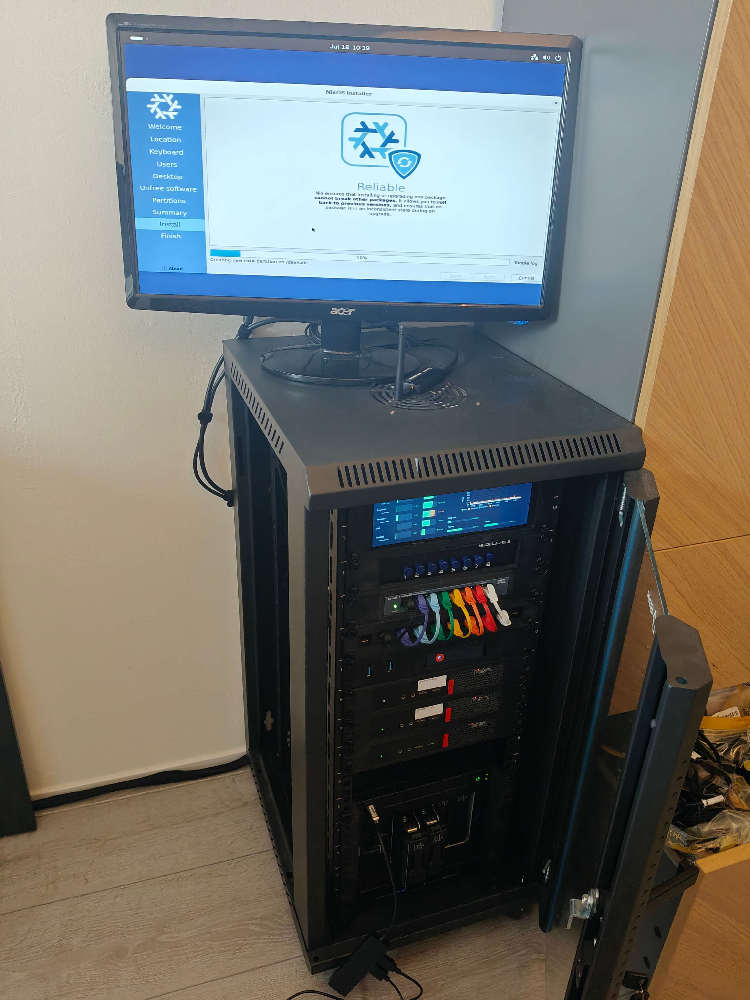
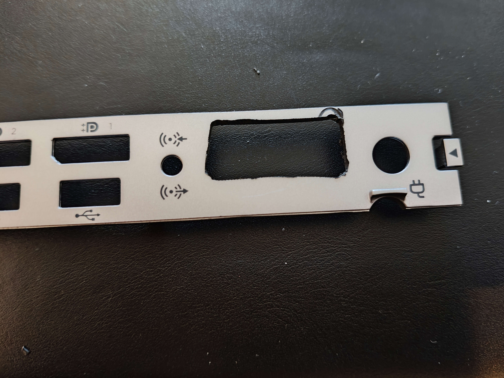
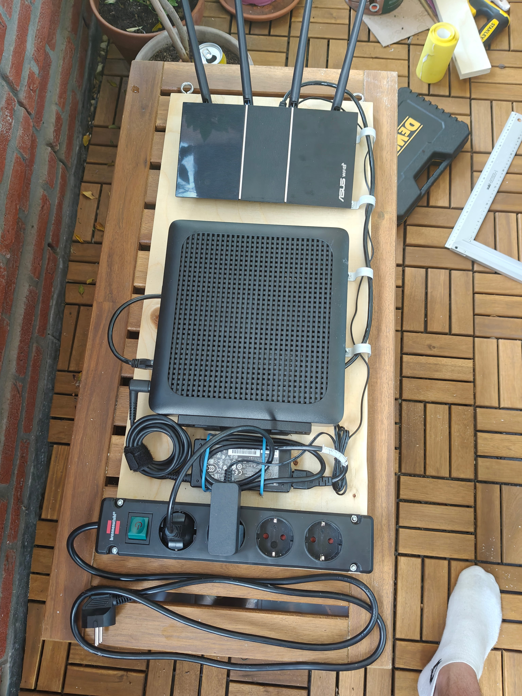

We are using NixOS at work, and I am really falling in love with it. 
I started playing around with it on my old laptop, migrated my new laptop to it and decided I wanted to migrate (almost) my entire homelab to it. 
There are a multitude of reasons to use NixOS, but for my case, what I liked most was this:

- Completely declarative, so none of the settings I have on any of my services can ever get lost if I don't document them properly. 
  And on top of that, I have more control and knowledge of what is _actually_ configured on my homelab, as opposed to the (extremely useful) [Proxmox VE Helper Scripts](https://community-scripts.org/) I was using before.
- On top of the last point: **Version control** for my configurations and settings!
- Complete reproducibility (byte-for-byte even!), so I don't even have to worry about backups for most of my services.
- Remote deployment, so no more struggle having to increase the resources for some containers (looking at you, Immich) for updating. 
  Everything can be build locally (and super quickly) on my laptop, and just pushed to the container.
- Easy updating. 
  No more running `update` for every container individually, just `nix flake update` and a helper script to update everything in my homelab.
- Easy rollbacks.
  Okay, I can just restore from a backup, but now if an update fails, I could also just `git stash` and push another version!
- Easy shared configurations between services.
  Many are on my Tailscale network, most need DNS servers configured, etc.
  No more replicating the same configuration over and over again!

There are many more reasons why one might choose NixOS, but these were the main advantages I saw for my homelab.

## Getting started

I wanted to keep Proxmox for virtualization on my hosts, but decided to use [NixOS Proxmox LXCs](https://nixos.wiki/wiki/Proxmox_Linux_Container) for all my services (though maybe at some point [proxmox-nixos](https://github.com/SaumonNet/proxmox-nixos) becomes stable enough to replace it with).
The [linked wiki page](https://nixos.wiki/wiki/Proxmox_Linux_Container) explains everything on setting it up from the downloadable template.
It is very useful to do this once, set some simple root password and to then just create a template out of it and create (linked) clones from it.
The initial setup can be done easily as follows:

First, create a new container from the template you downloaded (the filename may be different depending on the one you downloaded). Change the container id (the default below is just the next available one), storage location or container name if desired.
There is at least 3GB of memory required to do the initial deploy.
```bash
ctid=$(pvesh get /cluster/nextid)
ctname="nixos"
ctt="local:vztmpl/nixos-image-lxc-proxmox-26.05pre-git-x86_64-linux.tar.xz"
cts="local-lvm"     

pct create ${ctid} ${ctt} \
  --hostname=${ctname} \
  --ostype=nixos --unprivileged=0 --features nesting=1 \
  --net0 name=eth0,bridge=vmbr0,ip=dhcp \
  --arch=amd64 --swap=1024 --memory=2048 \
  --storage=${cts}
```
I tried to change some of the settings, but that seemed to break the LXC, it _has_ to be privileged and it _has_ to allow nesting.

Then increase the file system for the initial deploy
```bash
pct resize ${ctid} rootfs +2G
pct start ${ctid}
pct enter ${ctid}
```

And then initialize the container
```bash
source /etc/set-environment
passwd root
nano /etc/nixos/configuration.nix
```

Fill the `configuration.nix` file with
```nix
{ config, modulesPath, pkgs, lib, ... }:
{
  imports = [ 
    (modulesPath + "/virtualisation/proxmox-lxc.nix") 
  ];
  
  nix.settings = { 
    sandbox = false; 
  };  
  proxmoxLXC = {
    manageNetwork = false;
    privileged = true;
  };
  
  services.fstrim.enable = false; # Let Proxmox host handle fstrim

  boot.isContainer = true;
  boot.loader.grub.enable = false;

  # Have to be disabled, according to
  # https://taoofmac.com/space/blog/2024/08/17/1530
  systemd.suppressedSystemUnits = [
    "dev-mqueue.mount"
    "sys-kernel-debug.mount"
    "sys-fs-fuse-connections.mount"
  ];

  # Enable flakes
  nix.settings.experimental-features = [
    "nix-command"
    "flakes"
  ];

  # Enable SSH
  services.openssh = {
    enable = true;
    openFirewall = true;
    settings = {
        PermitRootLogin = "yes";
        PasswordAuthentication = true;
        PermitEmptyPasswords = "yes";
    };
  };

  # CHANGE THIS DEPENDING ON THE VERSION YOU DOWNLOADED
  system.stateVersion = "26.05";
}
```
**CHANGE THE `stateVersion` AS NEEDED**

Then run
```bash
nix-channel --update
nixos-rebuild switch --upgrade
```
to apply your initial configuration.

I couldn't ssh because of some error, so I added my public key to the authorized keys with

```bash
echo "ssh-rsa ...." >> /root/.ssh/authorized_keys
```
on the container.

You can now convert it to a template, and possibly use [Proxmox Datacenter Manager](https://www.proxmox.com/en/products/proxmox-datacenter-manager/overview), or backups and restores to network accessible storage ([Proxmox Backup Server](https://www.proxmox.com/en/products/proxmox-backup-server/overview) or simple backups to an NFS share) to move it to other nodes as well.

The hardware configuration is not needed for Proxmox LXCs, unlike for physical hosts, though it _is_ required to include the 
```nix
modulesPath + "/virtualisation/proxmox-lxc.nix"
```
file, even when using flakes. 
Not doing so will result in your container deployment failing, and the container getting into an inconsistent state, preventing it from doing anything until rebooted.

Since the linked clones of your template will have the same `machine-id` and SSH identity, I made a [script](https://github.com/DenSinH/homelab/blob/main/modules/lxc/init-lxc.sh) to rotate these on every new container.

## Migrating everything

To start simple, I first tried to migrate one of my piholes (I'm running 3). 
It seemed small, simple to configure, and there aren't many other components needed for it.
It also turned out that LLMs are extremely good at generating these configuration files.
Soon, I had a pihole container, _with_ an automatic regex allowlist filling systemd service to go with it.
After verifying that it worked, I deployed it to my two other proxmox hosts as well. 
Not with the standard PDM migration, or backups and restores, of course not!
I simply created a fresh (linked) clone of my `nixos` LXC template, checked the IP and did a `nixos-rebuild switch` to apply the configuration, ta-da!

Of course, the piholes also had to be available in Tailscale, which requires passthrough of `/dev/net/tun`, so the following lines in your lxc `/etc/pve/lxcs/<ctid>.conf` file:
```
lxc.cgroup2.devices.allow: c 10:200 rwm
lxc.mount.entry: /dev/net/tun dev/net/tun none bind,create=file
```
so I created a deployment helper script, with some checks on whether you are deploying to the right container.

Anyway, next I did my Tailscale subnet router.
This was simple enough, it just needs tailscale installed, and some extra `tailscale set` parameters.
This is still the shortest config for any service on my homelab:
```nix
{
  config,
  pkgs,
  lib,
  ...
}:

{
  # Enable tailscale
  imports = [
    ./tailscale.nix
  ];

  # Enable kernel IP forwarding
  boot.kernel.sysctl = {
    "net.ipv4.ip_forward" = 1;
    "net.ipv6.conf.all.forwarding" = 1;
  };

  services.tailscale = {
    useRoutingFeatures = "server";

    extraSetFlags = [
      # advertise a larger subnet so LAN takes priority at home
      "--advertise-routes=192.168.50.0/23"
    ];
  };
}
```
but it became _very_ clear how nice it is to have my homelab's documentation just right there, in code, in the configuration for it.
I would have had to write down this subnet trick, or re-figure it out if I ever had to set it up again.

Next easiest service was my telemetry stuff, influxdb and grafana. Then my cloudflare tunnel, and I even started to move away some of the services I hosted through Docker before (now only my [cookbook](https://chef.dennishilhorst.nl) is left!).

Some new services required new skills. For example, influxdb and grafana require tokens to be configured. 
Since you don't just want these tokens publicly visible anyone to see on your [homelab GitHub repo](https://github.com/DenSinH/homelab) (shameless plug), you can do either of two things:

- Have a private `homelab-secrets` repo as a submodule.
- Provision secrets manually.
- Learn [`sops-nix`](https://github.com/mic92/sops-nix) and use that to commit hashed versions of your secrets straight to a public git repo!

So I went with `sops-nix`, and it's great. 
All secrets are deployed as files to your hosts, and are only available runtime.


Then came scarier services: those with important data.
First I did Vaultwarden, as all data was local to the container anyway, so nothing could really go wrong, but it still felt a bit scary.
Thankfully, [plenty of information](https://github.com/dani-garcia/vaultwarden/wiki/Backing-up-your-vault) is available on migrating a Vaultwarden database, and it was really a lot easier than I thought.
It did require me to set up the Cloudflare DNS record again for HTTPS access, though I had already gone through and removed most of them when I migrated my cloudflare tunnel.

Next came Immich.
This felt a lot scarier, all data was on my NAS, what if something messed up and started deleting my photos?
I guess I have my ZFS snapshots and backup, but I never practiced restoring those so...
Fortunately, everything went well, really it was just a matter of copying over the old database password and that was that.
The NFS mount worked right away, everything was still there...
After migrating Immich I even noticed it just creates database backups by itself as well, so my worries were likely unnecessary (as they usually are).

Then another scary one: my *arr stack services.
Again lots of data which, though recreatable, I would still hate to lose.
There is a great project called [`nixflix`](https://github.com/kiriwalawren/nixflix) which packages everything you might want in your *arr stack for NixOS, so I went to work.
The default exmples were pretty complete, and I migrated the *arr services one-by-one.
It also uses postgres as a backend for the services instead of sqlite, so some data was lost, but thankfully radarr and sonarr are able to scan your library and restore everything that was there.
While I was migrating Jellyfin, the LXC I was running got corrupted somehow. 
I don't really know how it happened, but thankfully even that was easy to migrate.

After migrating came the tweaking.
I improved many of my existing services, setting up reverse proxies, tweaking and documenting settings, creating helper scripts and services.
Everything was possible now, without worrying about where to put it.

## Not done yet

Of course, now that all my services are on NixOS, I got bored again.
It started nagging me that my NAS was running TrueNAS SCALE, which is good in and of itself, but not declarative.
What if the boot drive crashes?
What if I change a setting and stuff gets messed up?
How do I even properly manage these permissions, it works but I don't want to break anything...

And then I even saw [this Reddit post](https://www.reddit.com/r/NixOS/comments/1uiy1c1/migrating_from_truenas_to_nixos_without_losing/), and I knew it was a sign.
I had to migrate my NAS as well.
This was the scariest thing to migrate, I am running an HP MicroServer Gen8, which has a lot of quirks.
I wrote another blog post on that before while I was setting it up.
But most importantly, _all my data_ was on there.
Immich data, documents, *arr stack data, backups, a lot would be lost and recovering would be a hassle, especially since all my previously configured settings would be lost as well.

And so I prepared: I read the blog post, took an old PC and an old hard drive I had lying around, created a configuration and with the help of an LLM, went through the steps on the test system first.
Unexpectedly, it... just worked, like right away.
And so I decided to take the step on a free Sunday and go for it.
First I dumped a bunch of settings from TrueNAS, both with the built-in export and from some terminal commands, and then came the point I could shut down TrueNAS for the last time.



I took out the data drives, plugged in my [Ventoy](https://www.ventoy.net) USB, and... No boot drive found!
Ugh, well I guess I'll burn the ISO directly on a USB then. 
I tried again and... Again no boot drive found...
A GPT partition table instead of MBR then? Again no luck...
Well, fortunately the bootloader I had set up on the internal boot USB can jump to any available hard disk, so I just booted into that with my Ventoy USB plugged in, tried one or two entries and... it worked!
I got into the NixOS installer, was _very_ careful about the settings I chose.
In particular, to install the bootloader on the SSD itself, _not_ on the internal USB with the additional grub bootloader, as I knew for certain that that worked.
After installing, I could boot into NixOS and everything was smooth sailing from there.
I deployed my initial configuration, shut down, plugged the drives back in, imported my pools and I was ready to go, just like that.

It is just so much fun when your initial deploy works and you can start fine-tuning your configuration.
Making everything slightly more efficient, more locked down, more automated.
With this done, I turned my head to the last infrastructural device that _wasn't_ configured declaratively: my router.

## Declare everything!

I have 2 ASUS routers (an AX-57 as the router and an AX-55 as an AP), running in mesh mode with ethernet backhaul. 
I liked the routers, the Wi-Fi mesh works well, the dashboard is convenient and there are plenty of settings to configure.
But, it wasn't NixOS, so they had to be replaced. 
Well at least, the routing part of them.
I looked around online for cheap hardware, and ended up finding [this GitHub repo](https://github.com/sharf-shawon/hp-t630-pfsense), explaining how someone added an additional 2.5Gbit NIC to an HP T630 and set up pfSense on it.
I found [this Reddit comment](https://www.reddit.com/r/NixOS/comments/1hdjpsv/comment/m1wnqq4/) with some very useful resources and figured this is what I wanted.
I found a second hand HP T630 with 4GB RAM and a 32GB SSD (which was still relatively expensive due to the crazy RAM/SSD prices).
When it came in, I tried to install NixOS, which actually failed (!) because there "wasn't enough RAM".
Turns out, the system reserves some amount for a frame buffer, which was configured to 1GB in the BIOS, leaving only 2.8GB, just shy of the 3GB required for the NixOS install.

I ordered an RTL8125B 2.5Gbit NIC online, sawed a hole in the back panel of the HP T630 and installed it. 



I wanted to get a bit more crafty though, so I got a plank of wood and a new mountable plug box and made a simple board to attach my router and my ASUS AX-57 to use as a Wi-Fi access point.



Setting up the Wi-Fi access points was it's own adventure.
I was doing this one evening, and even though the ASUS dashboards were easy to work with once everything is set up, the setup pages responded horribly on my phone, making typing barely possible.
What I didn't notice, was that autofill added an additional space to the Wi-Fi SSID when I tried to use that instead of typing.
Took me some time and a bit of stress to figure out why none of my Wi-Fi devices were connecting...

It's simple, but it was fun to make, and if we ever move to a new house, I can just take this off the wall and hang it back up in the utility closet of our new house.
After I got everything working again, and declared my entire network (sadly, with no VLAN separation as I have no managed switches), I took the next logical step and configured the router such that I no longer needed my ISP's router inbetween.
I did some testing and tweaking with QoS settings, set up [darkstat](https://github.com/emikulic/darkstat) for monitoring the network a bit and that was that.

With the router tucked away, I figured I would try to get rid of the ZigBee dongle that was an eyesore lying on top of my homelab's tiny rack.
Fortunately, [usbip](https://usbip.sourceforge.net/) exists, has a working [HACS plugin](https://github.com/cryptedx/ha-usbip-client) and [is packaged for Nix](https://search.nixos.org/packages?query=usbip).
I let an LLM generate me some more firewall rules, so only my HA instance could access the usbip server, and just like that, the dongle is also tucked away nicely inside our utility closet.
This setup has the added bonus that I could migrate the HA VM to any (current or future) proxmox node, without having to move the physical dongle to a different host.
Downside is that a connection to the router is required for the dongle to be connected to HA.
You win some, you lose some I guess.

## Now what?

Well, I guess I can still tweak some things.
Harden the homelab, add a bit more monitoring, perhaps some more automations, but the biggest job is done: my homelab is now purely declarative.
(Most) backups are unnecessary, updating should be easier in the future, tweaking and documenting changes should be simpler and any possible migrations should be a matter of a single 
```
nixos-rebuild switch
```