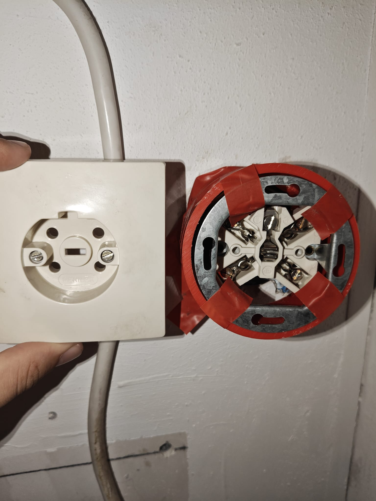
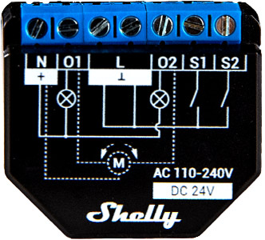
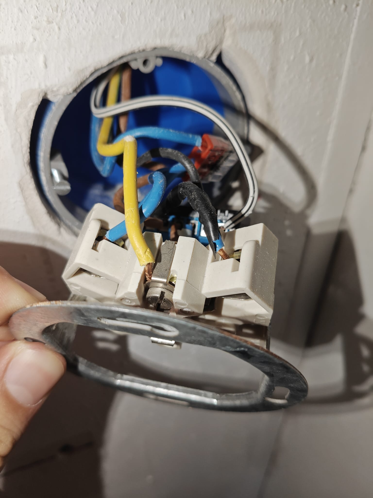
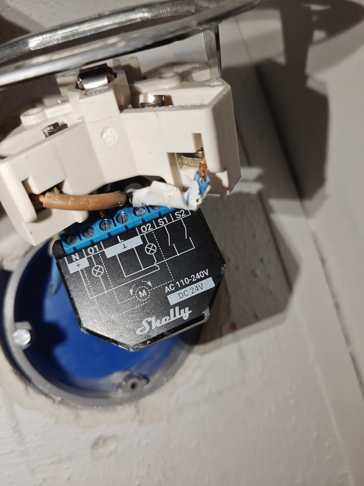
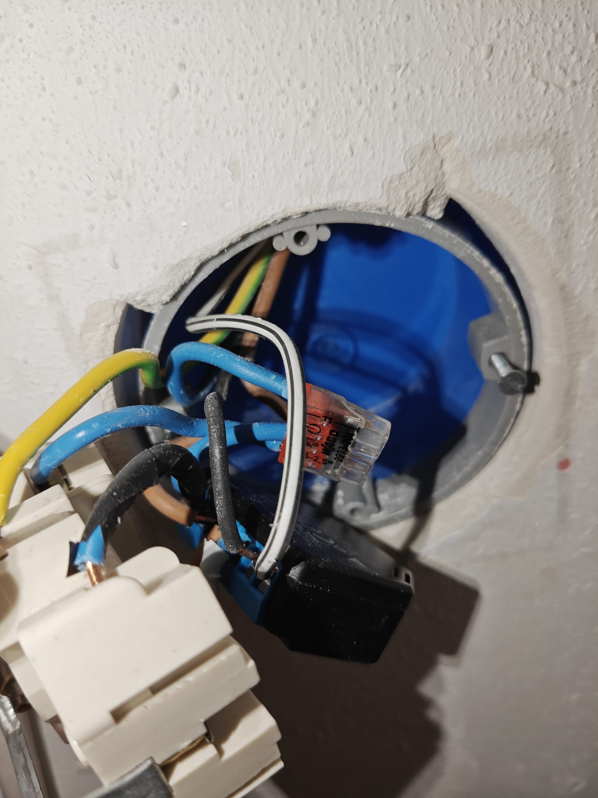
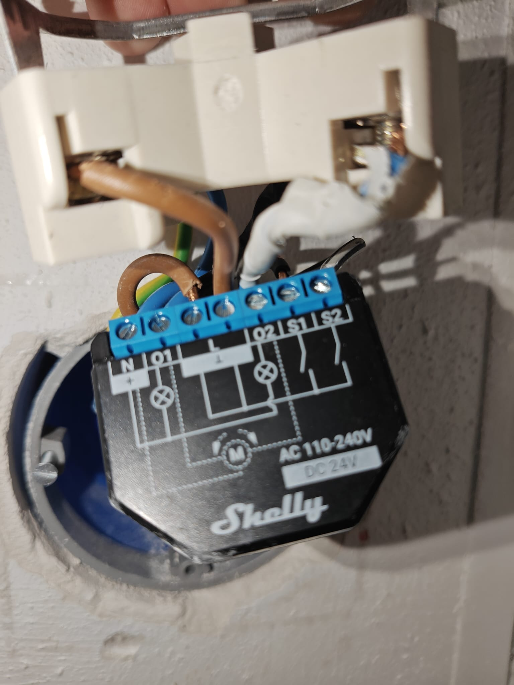
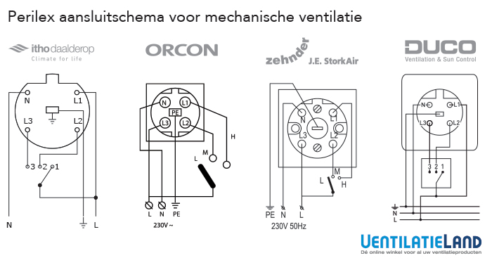
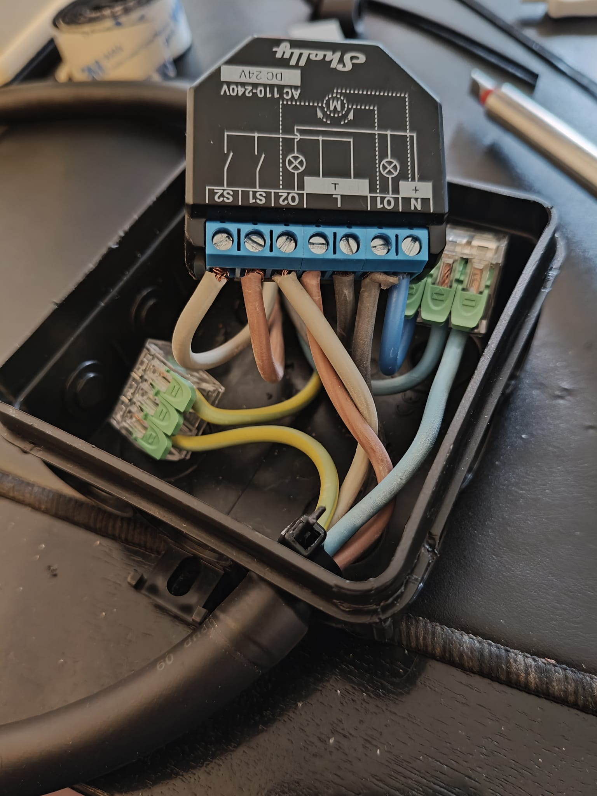
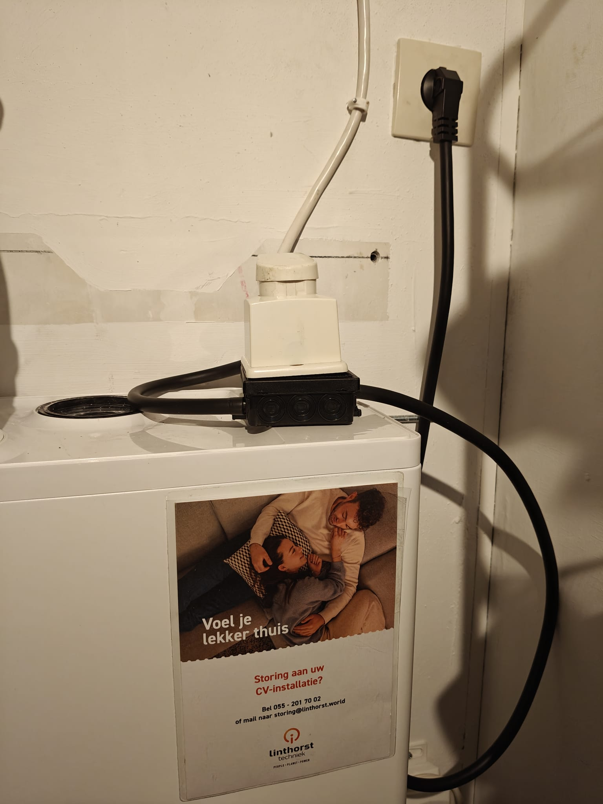

When we started living in our apartment, we had to turn the ventilation box on manually with the dial in the kitchen every time we showered.
It's not a huge deal, but we'd sometimes forget to turn it on, and sometimes forget to turn it off.
Of course, since I had already set up Home Assistant, the logical step was to automate the ventilation box with it.
It turns out this was possible [using a Shelly 2PM](https://www.reddit.com/r/homeassistant/comments/1etpgji).
I got [this model](https://kb.shelly.cloud/knowledge-base/shelly-plus-2pm) and finaggled it into the wall box:

Well, _in_ the wall box is kind of an overstatement: those boxes are pretty small and I couldn't get it to fit.
So I taped a piece of PVC pipe to it and called it a day... Not very safe, I know, but it works and is kind of hidden away.
It did start eating at me: what if we move at some point? I'm going to have to spend time undoing this installation at a time that may not at all be convenient.
That's why I decided to make a perilex extension cord with the shelly2pm in a box in the middle of the cable.
At the same time, I could document how it is wired and how it works.
The wiring diagram is shown on the Shelly Plus 2PM itself:

Basically, you have a few wires coming from the wall, they are listed below and indicated how they should be wired:

- **Ground**: Should _not_ be wired into the shelly2pm, pass through directly to the output
- **Neutral**: Should be split using a wire connector, passed through to the output _and_ to the shelly2pm **N**eutral
- **Line** (brown), should be wired to the *L* connector, and the other *L* connector should be passed through to the output.
- **Gray** (which I found to be more like white but whatever) and **Black** wires. In principle, these can be switched, but your ventilations high and low settings may be switched. They go into S1/S2 and out O1/O2.

I took some reference pictures of the wiring I had done before. 
It's a mess, I know, but at least I knew how I had it wired and working before, it does explain why it didn't fit into the wall box at all. 

I figured out that apparently [there are multiple ways a perilex plug can be wired for a ventilation box](https://www.ventilatieland.nl/nl_NL/blog/item/welk-perilex-aansluitschema-is-geschikt-voor-mijn-mechanische-ventilatie-61/).

In all options, Neutral goes in the top left, and ground goes in the middle.
The other wires depend on your brand of ventilation box.
And of course, your brand of perilex cord (I got [this one](https://www.karwei.nl/assortiment/perilex-stekker-haaks-met-snoer-2m-h07rn-f-5x1-5mm2/p/B225879), and I don't know how it is wired...)

Our ventilation box is an old Stork Air model, and the wiring that was already present was:
| Line | Color  |
|---|---|
|L1 | Black (high) |
|L2 | Gray (medium) |
|L3 | Brown (L) |

It turns out, the cord I got was _not_ wired like this.
The [wall-mounted perilex box I got](https://www.karwei.nl/assortiment/perilex-wandcontactdoos-opbouw-creme/p/B649933) I could wire up whichever way I wanted, so I figured I'd wire it in the same order.
Initially, I still thought every perilex plug would be wired the same, but apparently not as mentioned above.
The consequence was that the shelly2pm was not turned on (because apparently the wire I _thought_ would be the mains **L**ine was one of the selection wires).

This meant that the wall mains **L**ine (brown), connected L3, was _not_ the brown plug wire. 
When I set the dial to high, the shelly2pm did connect, which must mean it got power.
That must mean that the brown and gray wires in the plug must have been connected to the brown and "high" (black) wire on the wall (L1).
I switched the brown and black wires, because I first thought that would fix it.
Again the shelly2pm did not connect, but when I set it to "low" it did. 
From the original configuration, I then swapped brown and gray.
At this point, it seemed to work.

In the end, I think the wiring is as follows, though it would not make sense with any of the diagrams above...

| Wall Line | Wall Color  | Plug Line | Plug Color |
|---|---|---|---|
|L1 | Black (high) | L1 | Black |
|L2 | Gray (medium) | L2 | Brown  |
|L3 | Brown (L) | L3 | Gray |

It is fine though, if we ever move I can just pull out the plug and plug the ventilation box directly into the wall again, furture me will love me!
If we have a different brand of ventilation box then, the shelly will need to be rewired anyway, so I'll just keep this wiring for now...
If I rewire, I can reference this post, but at least I don't think I can break anything with the brown / gray / black ordering.

Anyway, the end result looked like this:

and is now plugged into our wall:

## Shelly Configuration

For completeness, I configured the shelly as follows:

- **Actions** (used to make sure both outputs are never active at once)
  - `output-0-disables-output-1` on Output (0): 
    - Event: Switch toggled on
    - Then do: `Control Output [Output (1)] [Output State: Off]`
  - `output-1-disables-output-0` on Output (1):
    - Event: Switch toggled on
    - Then do: `Control Output [Output (0)] [Output State: Off]`

In Home Assistant, I created similar actions to really make sure our ventilation box does not get any excessive voltage.
In the end, we only use only one of the outputs anyway (the high mode).
